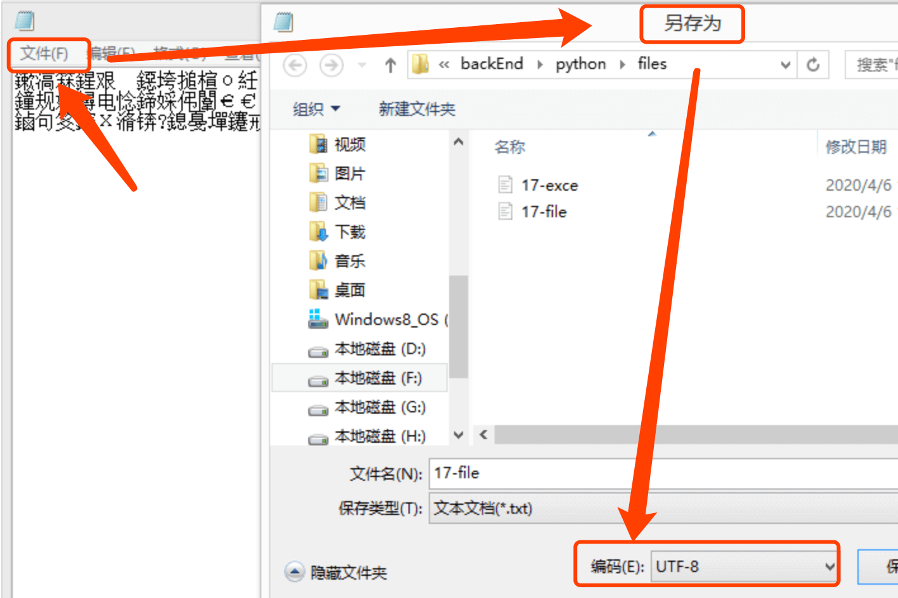

# 错误类型与可能原因分析
## 错误类型索引表
编号|错误类型| 描述
-| -|-
A| syntaxError| 语法错误(情况复杂，见下)
B| TypeError| 类型错误(数据类型不同导致)
C| NameError| 名称错误(变量未声明就使用)
D| ValueError| 值异常(不匹配的数据类型被一起操作)
E| IndentationError| 缩进错误(缺少、丢失、数量不对的格式缩进)
F| IndexError | 偏移量错误(获取列表等类型数据的元素时偏移量设置不对)
G| UnboundLocalError | 作用域错误(局部变量在局部作用域内有定义，但是却在定义前使用)
H| AttributeError | 属性错误(某个类调用自己没有的某属性时就会报错)
I| UnicodeDecodeError | 解码错误（要解码的内容得跟编码时用的编码表不一致就会报错）
J| FileNotFoundError | 文件找不到错误（读取文件时找不到文件就会报错）
K| ModuleNotFoundError | 模块导入错误
-| Zero。。 | 除数不能为零

## A、语法错误：

### 1、`syntaxError:invalid syntax`

无效的语法

```py
print(2019小石头)
#     print(2019小石头)
#                 ^
# SyntaxError: invalid syntax
```

### 2、`syntaxError:invalid character in identifier`

标识符中有无效的字符

```py
print(‘我左边的引号是中文的符号')
#     print(‘我左边的引号是中文的符号')
#                       ^
# SyntaxError: invalid character in identifier
```

**出错场景：**

这通常是因为在 python 中用了中文符号造成的。

在 Python 中，默认所有正确的语法，包括标点符号都是【英文】。不小心用了中文标点的话，计算机会无法识别，然后报错。

下边也是这种情况

### 3、`SyntaxError: EOL while scanning string literal`

扫描字符串文字终止

```py
print('我右边的引号是中文的符号‘)

# print('我右边的引号是中文的符号‘)
#                          ^
# SyntaxError: EOL while scanning string literal
```

### 4、`SyntaxError: 'return' outside function`

return没有在function函数内使用导致的报错

```py
for i in range(5):
  if(i == 3):
    return

# 报错内容如下：
#     return
#     ^
# SyntaxError: 'return' outside function
```

## B、类型错误(数据类型不同导致):
类型错误，说明是该数据类型做了不适合他自己做的事情。
### 1、`TypeError: unsupported operand type(s) for ...`

**出错场景：**

不同类型的数据进行结合计算或处理，就会发生错误。

```py
a = 1
b = '1'
print(a + b)
# Traceback (most recent call last):
#   print(a + b)
# TypeError: unsupported operand type(s) for +: 'int' and 'str'
```

Python 是强类型语言，不同类型的数据之间需要进行类型转换才能一起“共事”。

比如，`1+'1'`这么写，在 js 中肯定没问题，因为会进行类型转换，把数字 1 变成字符串 1，然后就变成了字符串拼接，最后的到 11。

但是 python 不会进行隐式类型转换，他发现你用数字 1+字符串 1，就会报类型错误，也就是 syntaxError:invalid syntax，告诉你这么写是无效的。

改正：

```py
a = 1
b = '1'
# print(a + b)
# # 这么写报错。改正如下：
print(a + int(b))
# 2，将字符串转换为int类型，进行加法运算
print(str(a) + b)
# 11，将整数转为字符串类型，进行字符串拼接。
```
### 2、`TypeError: 'bool' object is not iterable`

**出错场景：**

当你遍历一个不能被for迭代的对象时，就会触发对应的错误。

**int类型的整数对象不是可迭代的：**
```py
numberValue = 2020
for num in numberValue:
  print(num)
#     for num in numberValue:
# TypeError: 'int' object is not iterable
```
**float类型的浮点数对象不是可迭代的：**
```py
floatValue = 1.23
for num in floatValue:
  print(num)
#     for num in floatValue:
# TypeError: 'float' object is not iterable
```
**布尔类型的布尔对象不是可迭代的：**
```py
boolVal = True
for b in boolVal:
  print(b)
#     for b in boolVal:
# TypeError: 'bool' object is not iterable
```
**None类型的空不是可迭代的：**
```py
noneVal = None
for n in noneVal:
  print(n)
#     for n in noneVal:
# TypeError: 'NoneType' object is not iterable
```
### 3、`TypeError: 'list' object cannot be interpreted as an integer`
**出错场景：**

range内部只能接受整数。而列表转化不成整数，发生类型错误。
```py
nameList = ['小石头', 'xing.org1^', '郭菊锋']
for index in range(nameList):
  print(index)
#     for index in range(nameList):
# TypeError: 'list' object cannot be interpreted as an integer
```
**修改如下：**

先用len获取列表的长度，然后将计算的长度这个数字，放到range内部。
```py
nameList = ['小石头', 'xing.org1^', '郭菊锋']
for index in range(len(nameList)): # 0、1、2
  print(index)
```
### 4、`TypeError: 'tuple' object is not callable`
同样是类型错误，说明是该数据类型做了不适合他自己做的事情。
**出错场景：**

比如下例，我一不小心写了一个用tuple元祖类型的变量调用的bug。本意想获取元祖数据的第一项（下标为0）数据的值，结果脑子短路错把中括号写成了小括号导致的报错：
```py
tupleVal = ('a',1,True)
print(tupleVal(0))
# 打印如下
#     print(tupleVal(0)) # TypeError: 'tuple' object is not callable
# TypeError: 'tuple' object is not callable
```
**修改如下：**

针对本例，修改为正确的写法，根据偏移量获取数据在列表中也写了，使用中括号包裹偏移量：
```py
tupleVal = ('a',1,True)
print(tupleVal[0]) # 'a'
```
但是针对此类型的错误，说明元祖类型数据不能当函数调用。

## C、名称错误(变量未声明就使用):

### 1、`NameError: name 'xingorg1' is not defined`

**出错场景：**

直接使用一个没有声明的变量，当在本作用域和全局作用域中找不到时，就会发生错误。

```py
print(xingorg1)
#     print(xingorg1)
# NameError: name 'xingorg1' is not defined
```

## D、值异常

### 1、`ValueError: invalid literal for int() with base 10: '1.8'`

**出错场景：**

Python 的语法规则，浮点类型的字符串不能使用 int()函数进行强制转换。

```py
print(int('1.8'))
#     print(int('1.8'))
# ValueError: invalid literal for int() with base 10: '1.8'
```
**解决方案**

虽然浮点形式的字符串，不能使用 int()函数。但浮点数是可以被 int()函数强制转换的

可以先将字符串转换为浮点类型，再将浮点数转换为 int 类型。如下：

```py
print(int(float('1.8')))
# 1
```

不过对下面这种值异常的情况就无计可施了：

```py
print(int('非整数数字字符串'))
#     print(int('非整数数字字符串'))
# ValueError: invalid literal for int() with base 10: '非整数数字字符串'
```
纯文字类数据，无法转换为整数类型。

### 2、ValueError: too many values to unpack (expected 2)
**出错场景：**

表示了这里不应该有两个参数。
```py
nameList = ['小石头', 'xing.org1^', '郭菊锋']
for name,index in nameList:
  print(index)
#     for name,index in nameList:
# ValueError: too many values to unpack (expected 2)
```
**解决方案**

for循环里只用一个变量：
```py
nameList = ['小石头', 'xing.org1^', '郭菊锋']
for name,index in nameList:
  print(index)
```

## E、缩进错误

### 1、`IndentationError: expected an indented block`

**出错场景：**

对于 Python 而言，冒号和缩进是一种语法。它会帮助 Python 区分代码之间的层次，理解条件执行的逻辑及先后顺序。

> 【注：缩进是四个空格或一个 Tab 键】

在语句代码中的冒号“:”后、下一行内容的前面，要有缩进，空几个格。

如果在需要缩进的语句下边没有缩进的代码块，就会报错。

```py
number = 1
if number=='1':
print('1')
# File "main.py", line 3
#     print('1')
#         ^
# IndentationError: expected an indented block
```

这是因为当我们去掉缩进时，条件/语句（上边的 if）会和需要执行的命令（上边的 print）成为了两个不同的代码组，属于平行关系。

if 条件下面，缺少了可以执行的动作。那么无论条件成不成立，都不会执行什么操作，这个条件的存在没有任何意义。

**解决方案：**

加缩进

```py
number = 1
if number=='1':
  print('1') # 注意if下边需要执行的命令必须向右缩进
```

## F、偏移量错误

### 1、`IndexError: list index out of range`

**出错场景：**

提取/获取列表中的元素时，我们通常会用`列表名[偏移量]`的方式来操作。

但是列表可提取的偏移量是由列表的长度决定的。偏移量最小从0开始，最大可用偏移量为`列表长度-1`。

如果你的偏移量大于这个表达式的结果时，就会报下边的错。
```py
xingorg1 = ['小石头', 'xing.org1^', 181, True]
print(xingorg1[4]) # 偏移量超出——IndexError: list index out of range
```
换句话说，就是偏移量用的大了。

**解决方案：**

这其实在我们的编程中很难避免。比如这个列表不是你可控制的情况下，你循环中用了这个方法获取就有可能出现“偏移量超标”的情况。

```py
除了循环中，设定循环的上限为`列表长度-1`以外，
还可以用容错代码`try...except...`来做异常处理。
```


## G、作用域错误

### 1、`UnboundLocalError: local variable 'xxx' referenced before assignment`

**出错场景：**

报错解释：本地变量‘xxx’在赋值之前引用~

在函数内部的某变量G，`此变量被定义了的前提下`，在定义之前使用这个变量，就会报错：作用域局部绑定错误。

示例如下：
```py
# 作用域错误 - 局部变量在定义前使用
def UnboundLocalErrorTest():
  print(textVar) # 但是提前在赋值之前使用了
  textVar = 1 # 定义了该变量

UnboundLocalErrorTest()
```
⚠️这种千万要区分`NameError`变量未定义的错误。因为这种的变量已经定义了，只不过是在定义之前使用的。如下：
```py
def UnboundLocalErrorTest():
  print(textVar) # 没有定义就直接使用，是变量未定义的错误

UnboundLocalErrorTest()
```
⚠️这种也要注意使用环境，是在局部函数内部出现的作用域问题，因为如果在全局作用域环境里边，一个定义过的变量在定义前被使用，不会报这种错误，而是报`NameError`变量未定义的错误。如下：

```py
# 不同于局部未定义错误和局部作用域错误。在全局环境中会有如下表现：

print(globalNameErrorVar) # 但是提前使用，也报未定义错误
globalNameErrorVar = 12 # 虽然定义了
```
**解决方案：**

就老实点，定义完了再用呗：
```py
def NoUnboundLocalErrorTest():
  textVar = 1    # 1、定义
  print(textVar) # 2、使用

NoUnboundLocalErrorTest()
```

## H、属性错误(未定义属性获取失败)
### 1、`AttributeError: 'Son' object has no attribute 'familyName'`

**出错场景：**

在类中获取一个未定义的属性时，就会报错
```py
class AttributeError:
  def test(self):
    print(self.undefinedVar) # 在类中引用未定义的属性

attributeError = AttributeError()
attributeError.test()
```
或者在子类中，引用父类和子类都没定义的属性，同样也会报这个错误。有点像变量未定义，只不过这个是类中属性未定义。

不过，下边这个例子特殊，父类中明明定义了familyName，为啥调用还是说没这个属性呢?

```py
class Father:
  def __init__(self):
    self.familyName = '郭'

class Son(Father): # 子类Son继承父类Father
  def __init__(self):
    print(self.familyName) # AttributeError: 'Son' object has no attribute 'familyName'

son1 = Son()
```

这是因为这个属性定义在父类的__init__中。父类Father没有调用，所以init初始化方法不会执行，self.familyName的定义就不会执行。相当于在父类中没有定义这个属性。

**解决方案：**

第一种情况：
一个类中没定义属性就调用该属性，然后报错了。你说咋解决呢！
两个方法，一是不调用，二是在调用前定义好。
```py
class AttributeError:
  def __init__(self):
    self.undefinedVar = '提前定义好就能用了'
  def test(self):
    print(self.undefinedVar) # 这次打印就没问题了。因为属性已经定义了

attributeError = AttributeError()
attributeError.test()
```
第二种
子类继承父类的情况：
父类的属性不在__init__方法中定义即可。
```py
class Father:
  familyName = '郭哈哈哈'

  def language(self):
    print(self.familyName)

class Son(Father): # 子类Son继承父类Father
  def __init__(self):
    self.language()

son1 = Son()
```


## I、解码错误(解码时编码表使用错误):

### 1、`UnicodeDecodeError: 'gbk' codec can't decode byte 0xb4 in position 8: incomplete multibyte sequence`

**出错场景：**

要解码的一个内容，跟他被编码时用的编码表不一致导致报错。

```py
# 先编码
print('小石头'.encode('utf-8')) # b'\xe5\xb0\x8f\xe7\x9f\xb3\xe5\xa4\xb4'
# 再解码
print(b'\xe5\xb0\x8f\xe7\x9f\xb3\xe5\xa4\xb4'.decode('GBK'))
# 把utf-8编码的字符串用GBK来解码，就报错了。
# UnicodeDecodeError: 'gbk' codec can't decode byte 0xb4 in position 8: incomplete multibyte sequence
```
### 2、`UnicodeDecodeError: 'utf-8' codec can't decode byte 0xce in position 107: invalid continuation byte`
**出错场景：**

使用open()函数读取或写入文件时，需要传入第三个参数表示文件的编码格式。
```py
openResult = open('/Users/.../demo.txt','r',encoding='utf-8')
```
但是如果encoding=后边的类型和实际demo.txt文件的格式不一致的话，就会报错。

下边是报错的例子：


**解决方案**

```
查看txt文件的编码、修改txt文件编码
或者根据文件的实际编码，修改自己代码中的编码类型。
```
这里记录如何查看/修改txt文件编码：

1、找到文件，右键点击文件 - 打开方式 - 记事本。

2、在记事本中，左上角点击“文件” - “另存为”。

3、在“另存为”弹窗中查看编码/修改编码（具体位置如下图）


## J、文件找不到错误(文件查找失败错误):

### 1、`FileNotFoundError: [Errno 2] No such file or directory: '/.../file.txt'`

**出错场景：**

open()函数打开一个文件时、并且第二个参数是读取模式时，若第一个参数的路径错误或者该路径指向的文件根本不存在，就会报文件找不到的错误。

如下代码就报错了：
```py
openResult = open(site + '17-file.txt','r',encoding='utf-8') # 1、打开
# FileNotFoundError: [Errno 2] No such file or directory: '/Users/guojufeng/Documents/GitHub/xingorg1Note/17-file.txt'
```
原因很简单，就是在路径“/Users/guojufeng/Documents/GitHub/xingorg1Note/”下没有“17-file.txt”这个文件。

**但是这个例子比较特殊**：路径找不到就报错的前提是: open函数的第二个参数是r、rb、r+、rb+的时候。如果是w和a体系的，就不会报错、并会在该路径下新建同名文件。[详细知识点传送](./17-file.md#open函数)

## K、模块导入错误(模块导入失败):

### `ModuleNotFoundError: No module named 'requests'`

**出错场景：**

没有导入requests库

**解决办法：**

开始菜单选择运行，输入cmd运行，然后cd命令进入到python安装目录下的Scripts文件中，

然后输入`pip install requests`，就好了。

或者 打开Python文件的安装目录，进入Scripts文件中，按住Shift键+鼠标右击
<!--
模板：
##
### ``

**出错场景：**
```py
```


**解决方案：**
```py
```
-->
<Vssue title="Python 错误类型与引起原因分析" />
