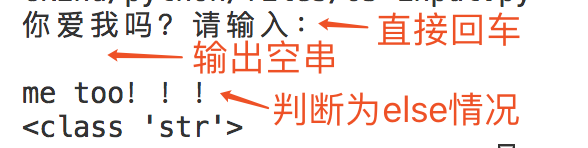
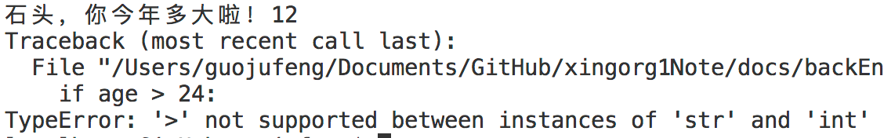
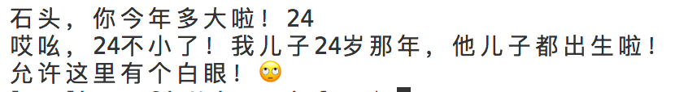

# input函数
input用途 - 实现人机交互：

1、你提出问题打印在屏幕上，

2、运行程序的人再输入回答。

3、按下回车，程序得到收集来的回答

4、之后，逻辑向下继续运行。

我们写的程可以实现根据他输入的回答进行不同的逻辑走向。

## 语法

### 示例
```py
result = input('你爱我吗？请输入：') # 此时，你提出的问题就是小括号“()”里边的那段字符串。result接受的就是运行的人输入的回答。运行的人按下回车，流程向下继续走。
if result == '不': # 拿着搜集到的结果数据“result”的值来处理我们的程序，根据result的值不同，逻辑走向也就不同。
  print('哼！你个大猪蹄子！')
else:
  print('me too！！！'))
```

### 参数
是一句话，只要填写你要询问客户的问题或你想输入、表达出来的任何数据，都行。且任何数据类型的皆可。

#### 比如下边几个不同参数的示例：

a、字符串类型的参数
```py
result = input('你爱我吗？请输入：')
# 运行时会打印：你爱我吗？请输入：
```
b、数字类型 参数
```py
result = input(520)
# 运行时会打印：520
```
c、布尔类型 参数
```py
result = input(True)
# 运行时会打印：True
```
d、甚至复杂类型（日后要整理的列表）参数都可以！
```py
result = input([1,2,3])
# 运行时会打印：[1,2,3]
```

### 返回值
### 正常情况下 

返回的就是用户输入的内容。

BUT⚠️， input函数的返回值，一定是**字符串格式**的。

也就意味着result变量肯定是字符串类型的数据。
```py
result = input('你爱我吗？请输入：')
print(type(result)) # <class 'str'>
```
控制台交流如下：

“你爱我吗？请输入：”

此时我输入了123，还是纯数字键盘输入的123喔。

然后观察print的result类型，发现是`<class 'str'>`，字符串格式。

### 非正常情况下 
那么，我用户不回答，直接回车跳过你这个问题呢？返回值是啥？看图说话：



可以看到图中最后一行打印的依旧是`<class 'str'>`，字符串格式。说明用户不输入，result接收的、或者说input返回的值是一个字符串形式的空串。

至于函数相关内容。我学过js接受起来很方便。可能零基础看起来就不爽了。

什么是参数、什么是返回值。。。心里一千个草泥马沸腾。

这个也按下不表，日后详谈。

但是说回正题。我们平时写逻辑，得把用户输入的可能性都考虑进去。也就是result如果不符合我们期望的情况，都考虑进去。

比如我上例中，result只要不是“不”字，就都走到else的情况了。

## 返回值数据类型转换
上边强调了好几遍，**input函数赋值给变量后，变量肯定是字符串格式。**

马上要过年了，过年肯定要见你的七大姑八大姨吧！

那么假如我们对input有以下使用场景呢：
```py

age = input('石头，你今年多大啦！')
if age > 24:
  marryBu = input('哎呀！那你有对象了吗？打算啥时候结婚啊！')
elif age < 24:
  whereWork = input('工作啦！那你年薪多少啊现在！')
else:
  print('哎吆，24不小了！我儿子24岁那年，他儿子都出生啦！')
print('允许这里有个白眼！🙄️')
```
好，那我们来分析这段程序。

运行你就会发现，这段程序肯定会报错。


`TypeError`的错误，具体错误分析就[去这里看](http://localhost:8080/xingorg1Note/backEnd/python/03-errorType.html#b%E3%80%81%E7%B1%BB%E5%9E%8B%E9%94%99%E8%AF%AF-%E6%95%B0%E6%8D%AE%E7%B1%BB%E5%9E%8B%E4%B8%8D%E5%90%8C%E5%AF%BC%E8%87%B4)，不赘述。

但是简而言之呢，就是说咱们截图中输入的 12 ，他是个字符串。

而到了下边if、else里，age和数字24来做判断。

python作为强类型语言对这样写法是零容忍的，所以就报错了。

说了这么多废话呢，就一句话概括：
**针对input的返回值使用时，注意进行类型转换。** 需要把字符串转换成你需要的其他类型再进行if判断。

上述代码改进如下：
```py
age = input('石头，你今年多大啦！')
# if age > 24: # 注释掉错误的，改进如下
if int(age) > 24: 
  marryBu = input('哎呀！那你有对象了吗？打算啥时候结婚啊！')
# elif age < 24: # 注释掉错误的，改进如下
elif int(age) < 24:
  whereWork = input('工作啦！那你年薪多少啊现在！')
else:
  print('哎吆，24不小了！我儿子24岁那年，他儿子都出生啦！')
print('允许这里有个白眼！🙄️')
```
最后放一下运行成功的图。（偷偷告诉你，主要是因为我喜欢那个白眼。）


从根源上改进的写法如下：
```py
# age = input('石头，你今年多大啦！')
age = int(input('石头，你今年多大啦！'))
if age > 24: 
  marryBu = input('哎呀！那你有对象了吗？打算啥时候结婚啊！')
elif age < 24:
  whereWork = input('工作啦！那你年薪多少啊现在！')
else:
  print('哎吆，24不小了！我儿子24岁那年，他儿子都出生啦！')
print('允许这里有个白眼！🙄️')
```

## 容错处理
⚠️ 接上文。

用`int()`强制类型转换的同时，你得确保用户输入的是可以用int转换的数据——即整数。如果他输入浮点数、布尔值、中英文字符串等，咱们上边写法的程序可能就挂了。

所以还是那句话，涉及到和用户打交道的时候，你必须得做`容错处理`。即你得把所有可能性都想到，因为你不能保证用户输入啥！

我觉得这也是前端苦逼的地方之一吧。❤️

## 动手吧
说了这么多，你也来写一写吧！

实现效果：
1、【简单】让用户输入自己的名字，然后打印出来“hello！用户的名字”

> 需要用到`input`、`print`、`变量赋值`等

2、【困难】汇率计算器：让用户输入要兑换的币种，再输入目标币种。输入用户的金额。输出转换后的结果。（文字描述枯燥，效果可百度“汇率计算”，看搜索结果的第一条在线小工具。体验过后用python实现）

> 需要用到`input`、`if语句`、`类型转换`、`print`、`变量赋值`、`算术运算符及表达式`等前边铺设过的知识点。

<Vssue title="【Python】input函数" />
