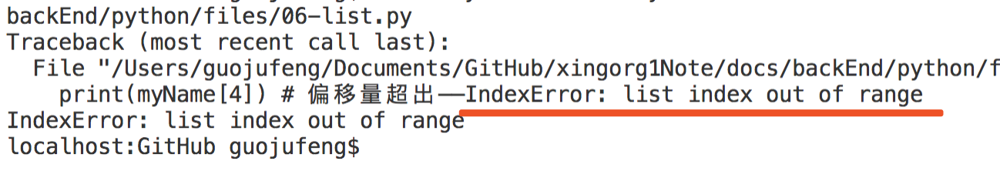

# 数据类型 - 列表(list)
## 一张图了解列表
先来一个脑图，一目了然

如果你看图看不懂我简写的是啥意思，可以看图下的详细信息。


## 列表是什么
列表是一堆元素的汇总，长得和JS中的数组一样。

它是数据类型的一种：`复杂数据类型`— —就是各种数据类型的集合

我们通常用列表+循环的方式来遍历多个元素。学习它很重要。


## 列表长啥样

### 语法格式

```py
# 伪代码
列表变量名 = [ 元素1, 元素2, ...后边可以有多个无数个元素 ]
```

### 代码示例

```py
# 记好这段代码，下边很多示例会用到
myName = ['小石头', 'xing.org1^', 181, True] 
```

### 格式特征

- 列表名是我自定义的，如示例中我的“myName”。
- 用等号给变量赋值，等号右边的就是列表。
- 列表中各元素需要用中括号包裹
- 中括号里可以包裹N多个元素
- 多个元素之间用英文逗号分割开
- 列表中的各个元素的类型可以是任何值

## 列表定义

定义一个列表  
```py
myName = ['小石头', 'xing.org1^', 181, True]
```

## 列表操作 - 提取单个：偏移量

### 什么是偏移量

偏移量（又叫 下标）就是每个元素的编号，从左边第一个元素开始，编号从0一直到正无穷。

我习惯叫“下标”。

​上例中，0就是偏移量。

通过偏移量来对列表进行索引（可理解为搜索定位），进而获取我们所需的元素。

### 偏移量提取示例
```py
print(myName[0])   # 得到“小石头”
```


### 偏移量值的大小
当偏移量的值是小于或等于“列表长度-1”的话，我们用偏移量获取列表中的元素，则返回的是列表中我们想要的这个元素。
```py
print(myName[0])   # 得到“小石头”
```

但当偏移量大于“列表长度-1”时，将会报错`IndexError: list index out of range`。
```py
print(myName[4]) # 偏移量超出——IndexError: list index out of range 
```

报错效果如下图：




### 偏移量提取的结果
结果是列表内的一个元素，数据类型取决于提取出来的那个元素是什么类型的。

## 列表操作 - 提取多个：切片
提取列表中的一个甚至多个元素用切片。具体切片是啥，见下边。

### 切片简介
写法上就是一个英文冒号，有时候左右会有数字，数字表示偏移量。

用冒号来截取列表元素的操作叫作切片。

### 切片示例
```py
print(myName[:]) # ['小石头', 'xing.org1^', 181, True]
print(myName[2:]) # [181, True]
print(myName[:2]) # ['小石头', 'xing.org1^']
print(myName[1:3]) # [ 'xing.org1^', 181]
```
### 切片作用
是将列表中的一个或多个元素选中。选出来的可以是一个片段里的元素，所以会叫“切片”。

`冒号`搭配上`列表名`和`中括号`，就能将元素提取出来。

### 切片选中规则

1、冒号左边为空没有数字的话，就从列表的第一个元素开始截取，即偏移量从0开始取。

2、冒号右边为空没有数字的话，就一直取到列表的最后一个元素。

3、对于左边的数字，切片时是包含关系。

4、而对于右边的数字，切片时不会包括，会切到右边数字的前一个。当然，如果右边没有数字，会切到最后一个。
比如说，你想切出来下标(偏移量)为2的元素，那么右边的数字就应该填3。因为他不会切3，而是切到3的前一个。


### 切片提取的结果
提取的结果是一个列表。可以理解为拷贝了list中的一段出来，然后放到了一个新的列表里。

## 列表操作 - 增加：append()
向列表中增加一个元素用append，append是一个函数。用法使用列表调用即可。如下：
```py
# 伪代码
列表变量名.append(参数)
```
### append参数
1、**参数类型**：不限。可以是字符串、数字这样的单个元素，也可以是列表、字典这样的集合元素。

2、**参数个数**：一个，且必须填一个。如果多填或不填都会报`TypeError`错误。
```py
myName.append() # 报错TypeError，必须要一个参数

# 报错如下
#     myName.append()
# TypeError: append() takes exactly one argument (0 given)
```

### append作用
append`会把参数追加到列表的末尾`。

增加内容后，列表的长度就会加一，增加的元素就会放在列表的末尾位置。
```py
myName.append('')
print(myName) # ['小石头', 'xing.org1^', 181, True, '']
```
一个空串被追加到了列表myName的末尾，成为最后一个元素。

## 列表操作 - 移除：pop()
### pop函数
用于移除列表中的一个元素。默认是移除最后一个元素，并且返回该元素的值
### pop示例
```py
popResult = myName.pop()
print(myName) # ['小石头', 'xing.org1^', 181]
print(popResult) # True
```
上例代码中，我们可以观察到两个知识点：  
* list调用pop函数后，列表的最后一个元素被移除。  
* list被移除的那个元素赋值给popResult变量后就是`True`，这说明pop返回移除的元素。

### pop作用
即可以删除列表内的最后一个元素，还能将其当作返回值提取出来，赋值给其他变量。

## 列表操作 - 删除：del()
### del参数
**参数个数**：可1个，也可多个。

### 删除单个：偏移量
写法如下
```py
del(myName[3]) # 删除掉True
```
填写你要删除元素所在列表内的偏移量到中括号中。用列表名[偏移量]的方式获取这个元素，然后当作参数传到del函数内当作参数即可将该元素从列表中删除。

上例中，偏移量3代表myName中的第四个元素“True”，用中括号+偏移量的方式提取出来后，再用del删除了。此时再打印myName发现“True”不在了。

### 隔段删除(多个元素)：偏移量
发现了个有趣的例子，如下：
```py
myName.append('')
print(myName)

del(myName[4])
print(myName)

del(myName[1],myName[2])
print(myName)
```
三个打印结果分别如下：
> ['小石头', 'xing.org1^', 181, True, '']

> ['小石头', 'xing.org1^', 181, True]

> ['小石头', 181]
第一个和第二个的打印，应该没有问题，`myName.append('')`往list后边增加了一个，空串成为偏移量为4所对应的元素。然后又`del(myName[4])`删除了第四个元素，所以打印第二行的内容和原来没增加前的myName又一样了。

但是第二个del我写的是`del(myName[1],myName[2])`，填写了两个参数，我希望删除“xing.org1^”和“181”这俩。

结果发现，删除的是“xing.org1^”和“True”。

我猜测它是先从“['小石头', 'xing.org1^', 181, True]”中删除第1个即“xing.org1^”。

之后列表变成“['小石头', 181, True]”，此时他再删除第2个，也就是“True”。

最后剩下了我们看到的打印结果：“['小石头', 181]”。

**看来我们即使一次性向del中传递多个参数，他也是一个一个执行的。并且后一个参数删除是在前一个参数删除执行结果的基础上再做的工作。**


### 删除片段(多个元素)：切片
<a href="#切片选中规则">切片选中规则</a>见上。

切片删除同偏移量一个原理。切片选中的片段被当作参数传递到del中，都会被删除。

所以直接看三个示例如下：
```py
del(myName[:2]) # 偏移量0、1选中，删除掉 小石头、xing.org1^。myName剩下[181,True]
```
```py
del(myName([2:])) # 偏移量2、3选中，删除掉 181、True。myName剩下[小石头,xing.org1^]
```
```py
del(myName([1:3])) # 偏移量1、2选中，删除掉xing.org1^、181。myName剩下[小石头,True]
```
### 删除整个：切片
用切片删除所有选中元素
```py
del(myName[:]) # myName成空list了。打印myName得到 []
```
### 删除整个：变量名

del参数为变量名，则删除整个list列表。
```py
del(myName) # myName就不存在了，再访问报“未定义”的错
```
⚠️myName被删除后，就不存在了，再访问就会报“[未定义](https://xingorg1.github.io/xingorg1Note/backEnd/python/03-errorType.html#nameerror-name-xingorg1-is-not-defined)”的错。

---

*以上，就是关于列表的一些知识点，不够完善我今后继续补充，希望对看到的你我有点帮助。*


<Vssue title="【Python】列表list" />
