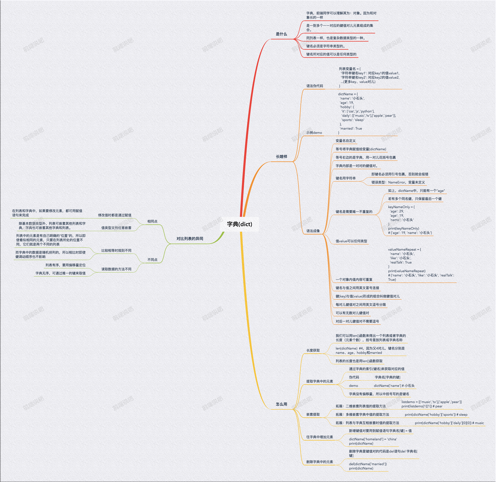

# 数据类型 - 字典(dict)

## 一张图get字典
一张图get字典的些许知识点

如果图中知识点描述过于概括，请看下列细文：

## 字典是什么

### js的对象
说到字典，前端同学可以理解其为：对象。因为python中的字典和js中的对象长的不能说很像，简直就是一样。

字典是一到多个一一对应的键值对儿元素组成的集合。

它同列表一样，也是复杂数据类型的一种。

其中，字典内的键名必须是字符串类型的，而键名所对应的值可以是任何类型的。

## 字典长啥样
说了这么多，字典到底啥样？揭开神秘面纱：

### 语法伪代码
```py
列表变量名 = {
  '字符串键名key1': 对应key1的值value1, 
  '字符串键名key2': 对应key2的值value2, 
  ...(更多key、value对儿)
}
```

### 示例demo
一个字典定义的demo代码，可以留神下，接下来的案例可能会用到。
```py
dictName = {
  'name': '小石头',
  'age': 19,
  'hobby': {
    'it': ['css','js','python'],
    'daily': [['music','tv'],['apple','pear']],
    'sports': 'sleep'
  },
  'married': True
}
```

### 语法成像
通过伪代码和demo代码我们可以总结出以下关于字典的特征点：

- 变量名自定义
- 等号将字典赋值给变量(dictName)
- 等号右边的是字典，用一对儿花括号包裹
- 字典内部是一对对的键值对(键:`key`; 值:`value`)。
- 键名用字符串
	- 即键名必须用引号包裹，否则就会报错
	- 错误类型：`NameError`，变量未定义的错误
- 键名是需要唯一不重复的
	- 如上，dictName中，只能有一个"age"
	- 若有多个同名键，只保留最后一个键
	```py
    keyNameOnly = {
      'age': 29,
      'age': 19,
      'name': '小石头'
    }
    print(keyNameOnly) 
    # {'age': 19, 'name': '小石头'} age对应29的键值对被覆盖了
  ```

- 值value可以任何类型
- 一个对象内值内容可重复
  ```py
    valueNameRepeat = {
      'name': '小石头',
      'like': '小石头',
      'realTalk': True
    }
    print(valueNameRepeat)
    # {'name': '小石头', 'like': '小石头', 'realTalk': True} 值‘小石头’重复也无所谓。
  ```
- 键名与值之间用英文冒号连接
- 键(key)与值(value)形成的组合叫做键值对儿
- 每对儿键值对之间用英文逗号分隔
- 字典里可以有无数对儿键值对
- 最后一对儿键值对不需要逗号

## 字典怎么用

### 字典长度获取——len函数

我们可以用`len()`函数来得出一个列表或者字典的长度（元素个数）

括号里放列表或字典名称
```py
print(len(dictName))  #4，因为又4对儿，键名分别是name、age、hobby和married
```
*列表的长度也是用len()函数获取*

### 提取字典中的元素

通过字典的索引(键名)来获取对应的值


伪代码:
```py
字典名[字典的键]
```
字典没有偏移量，所以中括号写的是键名

demo:
```py
dictName['name'] # 小石头
```

### 嵌套提取

**拓展 - 二维嵌套列表值的提取方法**

同样是用偏移量来获取。
```py
listdemo = [['music','tv'],['apple','pear']]
print(listdemo[1][1]) # pear
```
先用第一个偏移量获取最外边列表的第1个元素。得到列表`['apple','pear']`后，再继续追加一个偏移量[1]获取得到的列表`['apple','pear']`中第一个元素，打印出'pear'

**拓展 - 多维嵌套字典中值的提取方法**

因为是用键名，而不是偏移量的方法获取。所以感觉在理解逻辑上，比列表容易让初学者接受。
```py
print(dictName['hobby']['sports']) # sleep
```
先用键名"hobby"获取其对应的值，再用“hobby”里的"sports"获取其sports自己对应的值。得到"sleep"

**拓展 - 列表与字典互相嵌套时值的提取方法**

举一反三，概念加强版
```py
print(dictName['hobby']['daily'][0][0]) # music
```


### 往字典中增加元素

新增键值对要用到赋值语句
伪代码：
```py
字典名[键] = 值
```
自我感觉很好理解。只需要在提取的基础上赋值即可。

⚠️但可能需要注意，如果键名是字典中已经存在的，再这么操作就会直接修改这个键的值。

示例代码：
```py
dictName['homeland'] = 'china'
print(dictName)
```


### 删除字典中的元素

删除字典里键值对的代码是del语句

伪代码：
```py
del 字典名[键]
```
示例代码：
```py
del(dictName['married'])
print(dictName)
```


## 对比列表的异同

### 相同点

1、**修改值时都是通过赋值**：在列表和字典中，如果要修改元素，都可用赋值语句来完成

2、**值类型支持任意嵌套**：除基本数据类型外，列表可嵌套其他列表和字典，字典也可嵌套其他字典和列表。

### 不同点

1、**比较相等时规则不同**

列表中的元素是有自己明确的“位置”的，所以即使看似相同的元素，只要在列表所处的位置不同，它们就是两个不同的列表

而字典中的数据是随机排列的，所以相比时即使键调动顺序也不影响

代码观察：
```py

students1 = ['小明','小红','小刚']
students2 = ['小明','小红','小刚']
print(students1 == students2) 
# True 必须元素顺序、个数、内容皆一致则相同

students3 = ['小明','小红','小刚']
students4 = ['小明','小刚','小红']
print(students3 == students4) 
# False 改变了一下顺序就不相等了


scores1 = {'小明':95,'小红':90,'小刚':100}
scores2 = {'小刚':100,'小明':95,'小红':90}
print(scores1 == scores2) 
# True 只要两个字典中，键名及其分别对应的值都一一相等，则整个字典相等。

scores3 = {'小明':95,'小红':90,'小刚':100}
scores4 = {'小明':9,'小红':90,'小刚':100}
print(scores3 == scores4) 
# False 这样，即使键名一一对应，键名所对应的值不同，最终结果不相等。

```
2、**读取数据的方法不同**

列表有序，要用偏移量定位

字典无序，可通过唯一的键来取值

观察代码：
```py

# 提取列表中的数据 - 用偏移量/索引/下标
listdemo = ['apple','pear']
print(listdemo[1]) # pear

# 提取字典中的数据 - 用键名
keyNameOnly = {
  'age': 29,
  'age': 19,
  'name': '小石头'
}
print(keyNameOnly['age']) # 19
```
## 练习题
```py
you = {
  'name': '',
  'a': [{
    'b': {
      'c': '强撑',
      'love': 'anybody'
    }
  }],
  'age': 30
}
```
4、在b里边增加爱好，为一个数组，数组内容自定  
3、删除“age”  
2、修改“name”的值  
1、提取出“love”的值  


<Vssue title="【Python】字典dict" />