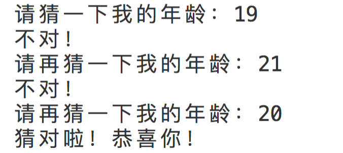

## while
和for一样，while也是实现循环代码的一种。
## 伪代码
先来看一段while的伪代码，了解下其语法格式。
```py
# 伪代码
while 条件语句:
  条件成立执行的[while子句]，位于缩进后边
else:
  循环完毕执行的代码块，位于缩进后边
```
学过js的能从上边的代码中看出来，这和js的while基本无差。  
将代码直译过来都是：当XXX条件成立的时候，执行XXX语句。直到条件不成立，就跳过while语句。

只不过python的特色是循环语句最后都会有自己的else语句。  
当while条件语句为“假”、循环执行完毕过后，流程都会走到else里边执行缩进后的任务。就好像出关口、必经之路的意思。
## 示例代码
来看一段示例代码
```py
whileVal = 1
while whileVal <= 3:
  print('while子句：', whileVal)
  whileVal += 1
else:
  print('while执行完毕，跳出循环后执行了我', whileVal)

# 打印结果
# while子句： 1
# while子句： 2
# while子句： 3
# while执行完毕，跳出循环后执行了我 4
```
在上边的代码中，其执行流程大致如下：

whileVal变量一开始是1。while的循环条件是变量小于等于3。
此时1小于3条件成立，执行while子句的代码。打印“while子句： 1”  
然后变量whileVal递增一位，变成2。

再次返回去判断条件，2<=3条件成立，继续执行while子句，打印“while子句： 2”  
然后变量whileVal递增一位，变成3。

再次返回去判断条件，3<=3条件成立，继续执行while子句，打印“while子句： 3”  
然后变量whileVal递增一位，变成4。

再次返回去判断条件，4<=3条件**不成立**，不执行while子句结束循环并跳出  

于是代码向下，执行else里的代码块，打印“while执行完毕，跳出循环后执行了我 4”  
并且我们可以通过打印明确得知，whileVal此时为4了。

## 和for循环的不同
while的知识点很简单，应用起来也很简单。  
不过同样作为循环，他和for循环有什么不同的呢？语法里为什么有了for还要有个while呢？

我们先来想想。上边的代码用for实现怎么写呢？  
下边是我的写法
```py
for forVal in range(1, 4):
  print('for子句：', forVal)
else:
  print('for执行完毕，跳出循环后执行了我', forVal)

# 打印结果如下：
# for子句： 1
# for子句： 2
# for子句： 3
# for执行完毕，跳出循环后执行了我 3
```
观察发现，for最后的变量值为3。  
也就是for在特定循环次数内，在你指定循环次数的情况下进行的迭代。

而while是你可以指定一个已经确定的临界值，只要在临界值里边的，都会执行while。即当while语句一直成立的时候，while子句就会一直执行。  
而更厉害的是，这个临界值可以是我们知道的（比如上边限制小于等于3，就是我们设定的已知临界值）。  
当然，这个临界值也可以是我们不知道的。比如让用户输入的情况，也比如无限循环的情况。代码分别如下。


## 根据用户输入判断条件
以下代码，是条件根据用户输入进行判断的例子。
```py
myAge = input('请猜一下我的年龄：')
while myAge != '20':
  print('不对！')
  myAge = input('请再猜一下我的年龄：')
else: 
  print('猜对啦！恭喜你！')
```


只要用户输入的不是20，这个循环中while子句的内容就会一直执行。

而当用户输入20时，条件不成立（myAge=20，而不是!=20），则跳出循环。执行else内容。

## 无限循环
利用while，我们还可以写一段死循环代码。
```py
# 请谨慎尝试！
while True:
  print('我停不下来了～')
```
在条件语句那里，可以填表达式，同样也可以填写布尔值。

当我们填写布尔值`True`时，因为条件一直成立。循环永远不停，就形成了我们常说的死循环代码。
## continue跳过本次循环
同for，continue语句在while中的使用作用一样是跳出本次单轮的循环、继续下次的循环。  
不再赘述，直接上代码：
```py
continueVal = 1
while continueVal <= 5:
  continueVal += 1
  if continueVal == 3:
    print('if条件中')
    continue
  else:
    print('continueVal的值：',continueVal)
else:
  print('循环结束')

# 打印结果：
# continueVal的值： 2
# if条件中
# continueVal的值： 4
# continueVal的值： 5
# continueVal的值： 6
# 循环结束
```
跳过了==3时的循环，  
并且打印了while语句所对应的else语句的内容。
## break跳出循环
同for，break语句在while中的使用作用一样是跳出循环。  
不再赘述，直接上代码：
```py
breakVal = 1
while breakVal <= 5:
  breakVal += 1
  if breakVal == 3:
    print('if条件中')
    break
  else:
    print('breakVal的值：',breakVal)
else:
  print('循环结束')

# 打印结果：
# breakVal的值： 2
# if条件中
```
条件==3时，直接结束循环，  
并且不再打印while语句所对应的else语句了。
## 练习题
### 实现1到10的数分别乘以100
分别用for循环和while循环俩种方案实现

<Vssue title="【Python】循环while" />