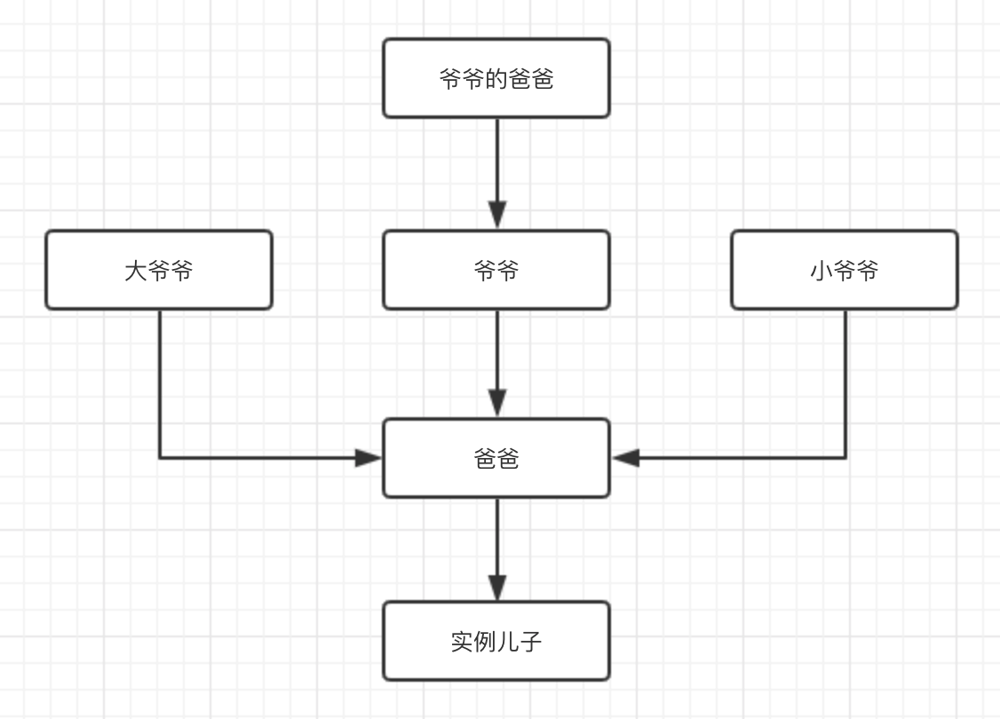
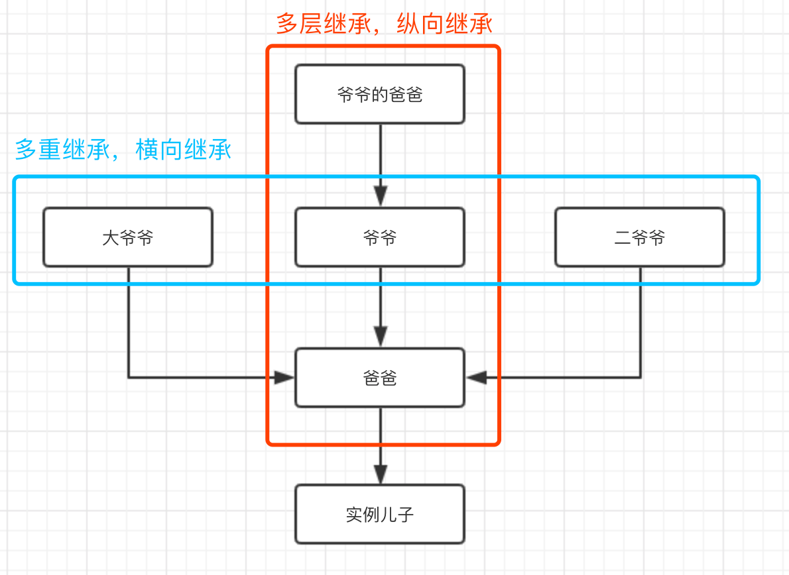

# 类的继承与创新
初中学政治我们就学到过，要继承中华民族的优秀文化、又要在继承的基础上创新。

文化是在不断继承和创新中发展的，代码也是。

我们可以用类特有的继承方法和拓展创新功能，实现代码层面的前进。

此节这两个知识点属于类中较高阶的操作，让用类写成的代码更容易复用、拓展和维护。

## 类的继承
说道“继承”这俩字，你能想到啥？

反正我想到的是，`儿子继承老子`的姓氏籍贯特征和遗产等。

放到代码里，就是`子类继承父类`的属性和方法。

也就是说，通过类的继承，可以让子类拥有父类拥有的所有属性和方法。  
这样，很多基础代码不用再重复书写，就可以直接实现代码的复用
### 子类和父类
那之前只了解到类的概念，怎么又多出来一个“子类”和“父类”的区分呢？

我想，这只是统称。凡是一个类A继承了另一个类B，那么A就是B的儿子，A就可以统称为子类，B就可以统称为父类。

题外话，我现在看这个“类”字看多了，咋看咋像“粪”。。。
### 继承的写法
#### 伪代码
```py
class A(B): 
  ...子类A的创新定制代码 # 下详
```

#### 注意：
1. A就是子类，B就是父类
2. 子类继承父类时，只需要子类右边的小括号内部写父类的类名即可。
3. 小括号和冒号都是英文格式

### 继承示例
还是以老子和儿子的身份，编写两段语义化的代码来了解下：
```py
# 子类Son继承父类Father的示意
class Father:
  familyName = '郭'
  nativePlace = '河北省'
    
  def language(self):
    print('说中国话')

class Son(Father): # 子类Son继承父类Father的写法
  def __init__(self, name):
    self.name = name
  def secondLanguage(self):
    self.language()
    print('学说了英语')
```
### 父类可以被无限个子类所继承
不是一个Son类可以继承Father，再来十个Son也可以。
```py
class Father:
  familyName = '郭' # 表示姓氏
  nativePlace = '河北省' # 表示籍贯
    
  def language(self): # 表示说母语的能力
    print('说中国话')

class Son(Father): # 子类Son继承父类Father
  def __init__(self, name):
    self.name = name
  def secondLanguage(self):
    self.language()
    print('学说了英语')

# 父类可以被无限个子类所继承
class Son2(Father): # 子类Son2继承父类Father
  def __init__(self):
    print('这里自己想象点Son2特色的代码吧，我绞尽脑汁了~')
  def characterFn(self):
    self.language()
    pass
class SonN(Father):
  pass

# ...
```
### 子类实例可调用父类属性和方法
子类继承来的属性和方法，也会传递给子类创建的实例。

这很好理解，子类继承父类的属性和方法，相当于子类外挂了父类的属性和方法。那么子类的实例，也就可以用这些属性和方法。

看个例子：
```py
class Father:
  familyName = '郭' # 表示姓氏
  nativePlace = '河北省' # 表示籍贯
    
  def language(self): # 表示说母语的能力
    print('说中国话')

class Son(Father): # 子类Son继承父类Father
  def __init__(self, name):
    self.name = name
  def secondLanguage(self):
    self.language()
    print('学说了英语')

son1 = Son('小菊')
print(son1.name + '姓' + son1.familyName) 
print(son1.name + '籍贯是' + son1.nativePlace)

# 打印结果：
# 小菊姓郭
# 小菊籍贯是河北省
```
实例化后的对象son1不仅有类Son内部定义的属性，还有父类Father内部定义的属性familyName、nativePlace等。

说明子类创建的实例，从子类那间接得到了父类的所有属性和方法，实例化对象可以随便运用。

## 类的始祖(根类)
### 根类 - object
在上边类的继承中，我们协议子类是Son、父类是Father。

那Father还有他的父类吗？

答案是有的，那就是`object`。

`object`是所有类的父类，我们将其称为根类（可理解为类的始祖）。

上述代码中，`class Father:`相当于写成`class Father(object)`

用isinstance来判断说明：
### 实例归属判断 - isinstance()
函数isinstance()，可以用来**判断某个实例是否属于某个类。**

观察代码看用法：
```py
# 实例归属判断 isinstance()
class Father:
  pass
class Son(Father):
  pass
class Son2:
  pass

son1 = Son()

print(1,isinstance(son1,Son)) # True
# 说明：子类创建的实例属于子类（废话。。。）

print(2,isinstance(son1,Father)) # True
# 说明：子类创建的实例同时也属于父类

print(3,isinstance(son1,object)) # True
# 说明：说明任何类创建的实例都属于根类object

print(4,isinstance(son1,(Son,Father))) # True
# 说明：son1属于Son的实例、也属于Father的实例

print(4,isinstance(son1,(Father,Son))) # True
# 说明：son1属于Son的实例、也属于Father的实例

print(5,isinstance(son1,Son2)) # False
# 说明：son1不是Son2的实例。A子类创建的实例不属于C子类

print(6,isinstance(Son,Father)) # False
# 说明：这俩都是类所以报错。

print(7,isinstance(Son,object)) # True
# 说明：可以说明Son(任何类)是根类object的实例

print(8,isinstance(Father,object)) # True
# 说明：可以说明Father(任何类)是根类object的实例

print(9,isinstance(Son,(Father,object))) # True
# 说明：Son不属于Father的实例，但他是根类object的实例
```


**总结用法：**
```py
# 第一种(伪代码)
isinstance(实例名, 类名)

# 第二种(伪代码)
isinstance(实例名, (类名1, 类名2...)) # 第二个参数是类名组成的元祖类型数据。
```
**返回结果：**  
布尔值。True或False。  
判断第一个参数是第二个参数的实例、或者判断第一个参数属于第二个参数中某个类的实例，则返回True。反之返回False。

**总结知识点：**
```
1. 子类创建的实例，同属于该子类的父类。
2. 父类创建的实例，与他的子类没关系。
3. 所有类，都属于根类object的实例。
4. 所有实例，都属于根类object的实例。
5. 子类A创建的实例，不属于其他C等子类的实例。
```
**具体值与基本类型的归属判断:**
看代码总结知识点吧
```py
print(isinstance(1,int)) # True
# 判断1是否为整数类的实例，实例1是整数类的实例

print(isinstance(1,str)) # False
# 实例1不是字符串类的实例

print(isinstance(1,(int,str))) # True
# 实例1是整数类的实例

print(isinstance(1,object)) # True
# 实例1是根类object的实例
```

## 类的继承升级版 - 多层继承

### 1、啥是多层继承
继承不仅可以发生在两个层级之间（即父类-子类），还可以有父类的父类、父类的父类的父类……

比如三个类A、B、C。A是爷爷、B是爸爸、C是儿子。我们可以B继承A、C再继承B。后边再可以有孙子D、D再继承C等等。。。  
这样一层一层，层层向上/向下继承，就是`多层继承`。

一“码”以蔽之：
### 2、伪代码
```py
class B(A):
  ...
class C(B):
  ...
class D(C):
  ... 
class...
```
### 3、示例代码
```py
# 多层继承
class Grand:
  familyName = '郭' # 表示姓氏
class Father(Grand):
  fatherName = '明爸'
 
class Son(Father):
  def __init__(self,name):
    self.sonName = name
    print(self.fatherName) # 子类拿到父类的属性
    print(self.familyName+self.sonName) # 子类拿到父类的父类 的属性

son = Son('小明')
# 执行后打印
# 明爸
# 郭小明

print(son.fatherName) # 实例拿到父类的属性
print(son.familyName + son.sonName) # 实例拿到父类的父类 的属性
# 执行后打印
# 明爸
# 郭小明
```
只要你愿意，你可以继续拓展上面的例子，或往上（爷爷的爸爸），或往下（儿子的儿子）。所以，多层继承又属于继承的深度拓展。

### 4、多层继承的好处
从上边代码就能看出功能，Son类创建的实例不仅可以调用Father的属性和方法、还能调用爷爷Grand类的属性和方法。

结论就是：**子类创建的实例可调用所有层级父类的属性和方法。**

## 类的继承升级版 - 多重继承

### 1、啥是多重继承
一个类同时继承多个类，就叫`多重继承`。就好像同时拥有好几个爸爸。
```py
# 伪代码：
class A(B,C,D):
```
### 2、就近继承
括号里B、C和D的顺序是有讲究的。和子类更相关的父类会放在更左侧。

也就是血缘关系越深的爸爸，在括号里的顺序越靠前。

既然跟B爸爸最亲，所以儿子A类创建的实例在调用属性和方法时，会优先在最左侧的父类B中找，找不到才会去第二左侧的父类C中找，依旧找不到才会最后去父类D中找。有点“**就近原则**”的意思，当然，如果最后几个类中都没找到，

### 3、爸爸近还是爷爷近
A类创建的实例调用属性和方法时，先在直接爸爸A类中找，还是先在爸爸继承的最亲近的B类中找？（这里A相当于A实例的爸爸，B相当于A实例的爷爷。）
```py
class Grand:
  name = '亲爷爷'
class Father(Grand):
  name = '爸爸'

son = Father()
# 说明先在直接爸爸中找属性
print(son.name) # 爸爸
```
总结：先在直接爸爸中找属性。找不到，再去爸爸继承的爷爷类们找。
### 4、多重继承的示例
用一段大型家庭伦理来写一个多重继承。

其中，身份情况如下：
代表的身份| 伦理身份| 对应下边示例中的变量
-| -| -
实例|儿子| son
A类|爸爸 | Father
B类|亲爷爷|爷爷Grand2在三个爷爷中排行老二
C类|大爷爷 | Grand1
D类|小爷爷 | Grand3

```py
# 多重继承
class Grand1:
  name = '大爷爷'
  grand1 = '我是老大'
  age = 60
class Grand2:
  name = '亲爷爷'
  grand2 = '我是老二'
  age = 59
class Grand3:
  name = '小爷爷'
  grand3 = '我是老三'
  age = 58
  hobby = '只有小爷爷有hobby属性'
class Father(Grand2, Grand1, Grand3):
  name = '爸爸'
  father = '我是爸爸'

son = Father()

# 说明先在直接爸爸中找属性
print(son.name) # 爸爸

# 以下说明实例可以拿到其他重继承类内部的属性
print(son.father) # 我是爸爸
print(son.grand1) # 我是老大
print(son.grand2) # 我是老二
print(son.grand3) # 我是老三

# 以下说明多重继承的就近原则 - 就近取最近的爷爷的属性
print(son.age) # 59

# 以下说明前几重父类都没有，取第一个有该属性的父类，哪怕这个父类时最后一重继承的
print(son.hobby) # 只有小爷爷有hobby属性
```
### 5、多重继承的作用
这自然不用说，子类创建的实例可调用所有重父类的属性和方法。

## 多层继承和多重继承

### 二者的比较
来一个比较表格吧
名称|多层继承| 多重继承|
-|-|-|
写法|class B(A):<br/>... <br/>class C(B):<br/>...  | class A(B, C, D):<br/>...
例子|孙子继承儿子、儿子继承爸爸、爸爸继承爷爷| 爸爸继承爷爷、大爷爷、小爷爷
特点|类在纵向上深度拓展| 类在横向上宽度扩展
作用|子类创建的实例，可调用所有层级的父类的属性和方法|同多层继承，可以调用所有。不过遵循就近原则。优先考虑靠近子类的父类的属性和方法。

### 二者的结合
多层继承和多重继承二者单用都是一条线，但是将二者结合起来，那就是个十字啊！

实例儿子依次继承了爸爸、爷爷、大爷爷、小爷爷、爷爷的爸爸这几个类的所有属性和方法。简直就是`超级富二代`啊~

多层继承和多重继承的结合，让继承的类拥有更多的属性和方法，且能更灵活地调用。进而，继承的力量也得以放大了很多倍。


一码以蔽之
```py
# 多层继承和多重继承结合
class GrandFather:
  name = '爷爷的爸爸-太爷爷'
  age = 102
class Grand1:
  name = '大爷爷'
class Grand2(GrandFather): # 多层继承1
  name = '亲爷爷'
class Grand3:
  name = '小爷爷(又名二爷爷)'
  age = 62
class Father(Grand2, Grand1, Grand3): # 多层继承2 + 多重继承
  name = '爸爸'

son = Father() # 实例儿子
print(son.name) # 爸爸
print(son.age) # 102
```
上例中，`son.age`这段打印的 102说明，虽然Grand2中没有，但是Grand2的多层继承GrandFather中有，所以顺序是先从多层中找，最后才考虑多重继承的Grand3中的变量。

总结：**多重继承中，若某父类还有父类的话，会先按照多层继承的顺序，纵向往上找到顶。若到顶还没有，则再继续向右扩展寻找多重的继承。**

## 类的创新
我们可以在继承父类代码的基础上，再书写子类自己更具自我特色的代码。这就是子类的创新部分了。

比如下边代码中，儿子的姓就是继承父亲的。儿子的名字就是自己创新的部分。儿子籍贯是继承父类后生下来就有的，但是以后自己跑到北京、杭州居住，那就是自己创新的部分。
### 创新 - 新增代码
```py
# 子类继承父类并做自我创新
class Father:
  familyName = '郭' # 姓氏
  nativePlace = '河北省' # 籍贯
  def language(self):
    print('%s家，母语说中国话' %(self.familyName))

class Son(Father): # 子类Son继承父类Father
  def __init__(self, name, presentAddress):
    self.name = name # 子类创新自己的属性name
    self.presentAddress = presentAddress # 子类创新自己的属性presentAddress

  def secondLanguage(self, languageName): # 子类创新自己的方法secondLanguage
    self.language()
    print('%s单独学说了%s' %(self.name, languageName))
    
  def resume(self): # 子类创新自己的方法resume
    print('%s姓%s,籍贯是%s。现居住在%s' %(self.name, self.familyName,self.nativePlace, self.presentAddress))

# 子类的第一个实例
son1 = Son('小菊', '北京')
son1.secondLanguage('英语')
son1.resume()

# 子类的第二个实例
son2 = Son('小锋', '杭州')
son2.secondLanguage('韩语')
son2.resume()

# 实例既可以用子类的属性和方法，也可以调用父类的属性和方法
print(son1.familyName)
print(son1.nativePlace)
```
上述代码中，  
子类内部用的self.language()、以及这个language方法内部用的属性familyName、子类自己方法resume中用的self.nativePlace等都是继承自父类Father的。  
这就是继承的部分。

Son类中的self.name、self.presentAddress 是属于子类新增的属于自己的属性、  
self.secondLanguage、self.resume 是属于子类新增的属于自己的方法。这就是创新的部分。  

*好吧，我承认这是一句多余的不行的废话*

### 创新 - 修改(重写)继承的内容
在继承的基础上可以做新加代码，甚至可以重写（修改）继承来的属性和方法。

`重写代码`: 是在子类中，对父类代码的修改。


还是用代码来说明问题，在上边代码的基础上，我们想一段情景剧：

Father类现在有一个二儿子Son2，他从小生下来被过继给了日本的亲叔叔。  
因为叔叔和爸爸同姓，所以继承的属性“familyName”不用管，还是姓“郭”。但是到了日本后上户口就是日本的籍贯了，所以“nativePlace”得修改重写。  
另外虽然是爸爸的儿子（继承自Father），但是因为在日本长大，所以母语变成说日语了。于是我们重写了继承来自爸爸类的方法“language”。如下
```py
class Father:
  familyName = '郭'
  nativePlace = '河北省'
  def language(self):
    print('%s家，母语说中国话' %(self.familyName))

class Son(Father): # 子类Son继承父类Father
  # ...代码同上一段里的

class Son2(Father): # 继承父类Father，不过被过继给叔叔的二儿子类Son2
  languageTxt = '日语' # 自己的属性，属新增的创新
  nativePlace = '北海道' # 修改的属性，属重写的创新
  def language(self): # 修改的方法，属重写的创新
    print('我的母语说：', self.languageTxt) # 里边的代码有自己定制的内容，属于重写。
  
son2 = Son2()
son2.language()
# 我的母语说： 日语
```
可见，重写父类的属性和方法，只要在子类中重新定义同名的变量，并做自己的定制代码即可。

但是，直接在Son2里这么写，Father会不会伤心呢？  
到底是自己生的儿子，给了别人后就这么迫不及待、直接的修改，爸爸的心，痛啊！

所以，重写代码按照上边这么写，他粗鲁了。那有什么优雅的重写吗？

### 优雅的重写
```py
# 优雅的重写
class Father:
  familyName = '郭'
  nativePlace = '河北省'
  def language(self, languageTxt = '中国话'): # 需要父类的这个方法协助修改
    print('%s家，母语说%s' %(self.familyName, languageTxt)) 

class Son2(Father):
  languageTxt = '日语'
  nativePlace = '北海道'
  def language(self): # 依旧重写方法
    Father.language(self, self.languageTxt) # 不过里边的代码不再是粗鲁的直接修改为自己的内容，而是调用父类的方法，但是传不同的参数。
  
son2 = Son2()
son2.language()
# 郭家，母语说日语
```
上边代码，依旧重写方法。不过里边的代码不再是粗鲁的直接修改为自己的内容，而是调用父类的方法，但是传不同的参数。

---

总结：所谓创新，在复用代码的基础上，又能满足个性化的需求。