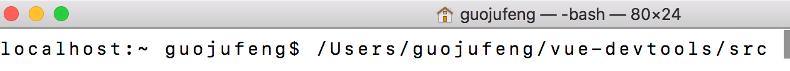
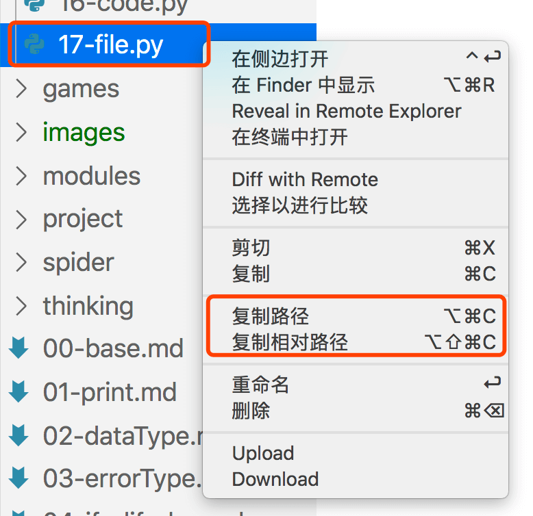
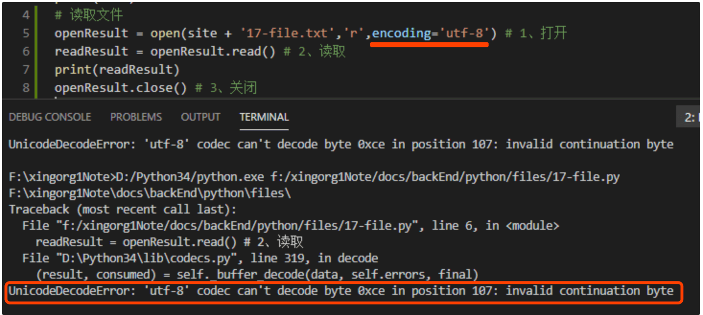
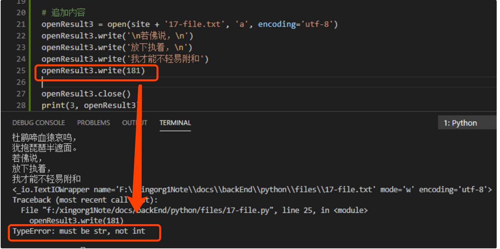
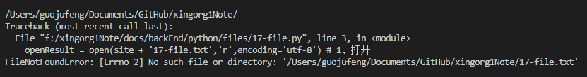

# python中的文件读写
文件读写，是Python代码调用电脑文件的主要功能，能被用于读取和写入文本、音频片段、Excel文档、邮件以及任何保存在电脑上的东西。

可使用python批量的操作本地文件，进行文件的读写。
## 拓展路径小知识
读写文件需要让计算机先找到文件的路径，而编写路径代码前我们人类得先准确找到文件路径。

以下整理路径相关知识
### 相对路径和绝对路径
绝对路径：就是最完整的路径

相对路径：指的就是【相对于当前python文件】的路径

### 路径获取
#### 1、文件拖拽的方式（mac）
要获得你的文件路径，只需要把目标文件直接拖到编辑器终端的窗口里（我这里用的vscode的终端。或可以用电脑自带的命令行），就会显示出文件地址，然后复制一下就好。拖到终端获取的地址是绝对路径。

出现路径：

只针对mac。

因为win的vscode终端里，路径显示的很完整了。拷贝之后改为"\\\\"即可。

#### 2、VScode里的快捷选项
用VS Code打开文件夹，选中文件后点击右键，选择“复制路径”或“复制相对路径”（mac和win通用）：

#### 3、pwd命令
mac电脑中，还可以在命令行中使用`pwd`获取当前cmd打开时所在文件夹的路径。


### “\”在python中需要转义
特殊的：Windows系统里，常用“\”来表示绝对路径，但是“\”在python中是转义字符，所以时常会有冲突。为了避坑，Windows的绝对路径通常要稍作处理，写成类似以下两种形式：
```py
#第一种：将'\'替换成'\\'
'C:\\Users\\Ted\\Desktop\\test\\abc.txt'

#第二种：在路径前加上字母r
r'C:\Users\Ted\Desktop\test\abc.txt'
```

## 读取文件
问，把大象放到冰箱需要几步？
答：打开冰箱 - 放入大象 - 关上冰箱

再问，读取文件需要几步？
答：打开文件 - 读取信息 - 关闭文件

### 打开文件
使用`open()`函数打开文件
```py
openResult = open('/Users/.../demo.txt','r',encoding='utf-8')
# openResult变量用于存放open读取的文件数据，以便对其进行后续操作。
```
open各参数说明：
参数|说明
-|-
地址参数|open函数内的第一个参数，表示文件的路径。可以是绝对路径、也可以是相对路径。
r| 第二个参数表示打开文件的模式。这里是字符串 'r'，表示 read，表示我们以读的模式打开了这个文件。
encoding='utf-8'|表示的是返回的数据采用何种编码，一般采用'utf-8'或者'gbk'。
注意：如果这里填写的编码类型和文件本身的编码格式不一致的话，就会报错。

上图用“utf-8”编码模式打开，但是文本的编码实际是“ANSI”。就报了这种错误。
### 读取
#### 用`read()`函数将整个文件一次性读取出来
```py
readResult = openResult.read() # 文件读取后的字符串内容赋值给readResult变量
print(readResult) # 可以打印出读取的内容
```
read() 会从txt文件**取出全部内容，是一个字符串。**
#### 用`readlines()`函数逐行读取文件的内容
```py
readResult = openResult.readlines() # 逐行读取
print(readResult)
```
readlines() 会从txt文件**取得一个列表**，列表中的每个字符串就是读取的文件中的每一行。而且每个字符串后面还有换行的\n符号。

如有txt文件，内容如下：
```md
小石头 100 93 83
郭菊锋 89 67 9
xing.org1^ 23 48 100
```
则用上边的代码readlines()读取后，打印readResult的结果就是长这样的：
```md
['小石头 100 93 83\n', '郭菊锋 89 67 9\n', 'xing.org1^ 23 48 100']
```
这样就可以用for循环遍历列表，逐行处理数据。*（具体做法可以看最后边的小练习）*

### 关闭文件
使用的是close()函数
```py
openResult.close() # 直接关闭即可
```
#### 文件关闭的必要性：

1.计算机能够打开的文件数量是有限制的，open()过多而不close()的话，就不能再打开文件了。

2.能保证写入的内容已经在文件里被保存好了。

**文件关闭之后就不能再对这个文件进行读写了。**
如果还需要读写这个文件的话，就要再次 open() 打开这个文件。

### 读取文件总结三步
```py
openResult = open('/Users/.../demo.txt','r',encoding='utf-8') # 1、打开
readResult = openResult.read() # 2、读取
print(readResult) # 2+1、可以对读取的文件进行使用操作
openResult.close() # 3、关闭
```
## 文件写入
问，把大象放到冰箱需要几步？
答：打开冰箱 - 放入大象 - 关上冰箱

再问，文件写入需要几步？
答：打开文件 - 写入信息 - 关闭文件
### 打开文件
同样还是使用open()函数打开文件

但第二个参数，打开的模式要改变一下：
```py
openResult = open('/Users/.../demo.txt','w',encoding='utf-8')
# openResult变量用于存放open打开的文件的数据，以便对其进行后续操作。
```
或者另一种写法：
```py
openResult = open('/Users/.../demo.txt','a',encoding='utf-8')
```
open各参数说明（其他参数见上边表格，这里重点说第二个参数）：
参数|说明
-|-
w| 第二个参数表示打开文件时的模式。字符串'w'表示 write，即以写入的模式打开文件。不过值得注意的是，‘w’是覆盖式写入，新write的内容会覆盖该文件原有的内容。表现上就是先清空文件内容，再写入。
a| 字符串'a'表示append，顾名思义，就是向后追加的意思。其和'w'作用一样都是向文件中写入的模式。不过append更人性化的是，向原有文件的内容之后追加内容，而不是直接覆盖源文件的内容。
**在'w'和'a'模式下，如果你打开的文件不存在，那么open()函数会自动帮你创建一个，不会报错。**
### 写入
#### 使用`write()`函数往文件中写入一个内容
```py
openResult.write('小石头\n') # 向openResult中写入内容。write参数必须是字符串，表示要写入的内容
openResult.write('xing.org1^\n') # \n表示换行符。
print(openResult)
```
注意，写入时，write函数内容不要尝试用数字，不然你会体会到报错的报复：


那我们就想写入一个序列（列表）的话，该怎么做呢？

#### 使用`writelines()`函数向文本中写入序列内容
```py
listVal = ['小石头\n', 'xing.org1^\n'] # 一个待写入的列表。要换行还要自己加入换行符
openResult.writelines(listVal) # writelines参数接受一个序列
```

### 关闭文件
关闭文件，依旧使用close()函数
```py
openResult.close() # 直接关闭即可
```
### 总结三步
重写文件内容：
```py
# 用write模式打开文件
openResult = open('/Users/.../demo.txt','w',encoding='utf-8') # 1、打开（write）
openResult.write('小石头\n') # 2、覆盖源文件内容、写入
openResult.write('xing.org1^\n')
openResult.close() # 3、关闭
```
或者，追加内容：
```py
# 用append模式打开文件
openResult = open('/Users/.../demo.txt','a',encoding='utf-8') # 1、打开（append）
openResult.write('小石头\n') # 2、向源文件内容之后追加、写入
openResult.write('xing.org1^\n')
openResult.close() # 3、关闭
```
此时可以观察，txt文件里的内容已经被修改了

## open函数
### 打开文件的几种模式
参照上边的代码，open函数调用时，第二个参数就需要传入是r还是w亦或者是其他模式，表示只读还是只写还是其他等等。

为什么打开的时候就要决定是读还是写的模式，之后决定不行吗？

这是因为，计算机非常注意数据的保密性，在打开时就要决定以什么模式打开文件。

而除了'r'，还有'w'(写入)，'a'(追加)等模式，详见下表：
模式|全写|含义|说明|文件不存在
-|-|-|-|-
r|read|只读模式|读取文件|文件不存在就报错，<br/>文件存在指针在开头<br/>从头开始，扫描读取
w|write|只写模式|覆盖源文件，写入新数据|文件不存在就新建，<br/>存在就覆盖
a|append|追加模式|在源文件内容的基础上<br/>追加写入新内容|文件不存在新建，<br/>存在指针放到末尾追加内容
* read文件不存在就报错

### 二进制资源读写
w和a写入的都是文本内容。

如果想写入图片、视频、音频等这些以二进制形式进行存储的资源内容时，需要使用‘wb’这些以二进制的方式打开并读写文本的模式。
模式<br/>分类|普通<br/>模式|b<br/>(bytes,字节)|+|b+|文件<br/>不存在
-|-|-|-|-|-
read<br/>(读取)|r 只读|rb 二进制只读 |r+ 读写| rb+ 二进制读写| 报错
write<br/>(写入)|w 只写|wb 二进制只写|w+ 读写| wb+ 二进制读写| 新建文件
append<br/>(追加)|a 追加|ab 二进制追加|a+ 追加且可读| ab+ 二进制追加且可读| 新建文件

## with关键字
使用`with`配合open函数来读取文件，可以不用写close()来关闭文件。这样可以防止我们代码最后忘记关闭文件或频繁关闭文件，造成资源占用或代码冗余的情况。

### 格式
```
with open() as xxx:
```
### 语法
```py
with open('文件地址','读写模式') as 变量名: #格式：注意冒号
    变量名.write('写入内容') #冒号下对文件的操作要缩进

#最后无需用close()关闭
```
### 写法
```py
with open('./demo.txt','a') as openResult:
    openResult.write('小石头')
```

## 小练习
文件读写操作小练习:

本地一个demo.txt文件，文件内容如下：
```md
<!-- 原来的，demo.txt文件内容 -->
小石头 100 93 83
郭菊锋 89 67 9
xing.org1^ 23 48 100
```
分别是三个人的语文、数学、英语成绩。

练习目标是读取文件后计算三人的总成绩。然后写到demo文件下，生成格式如：
```md
<!-- 修改后，demo.txt文件内容 -->
小石头 100 93 83
郭菊锋 89 67 9
xing.org1^ 23 48 100

总分：
小石头 276
郭菊锋 165
xing.org1^ 171
```

[练习参考答案及源代码](https://github.com/xingorg1/xingorg1Note/blob/master/docs/backEnd/python/files/17-file.py#L37)
<Vssue title="Python 文件读写" />
