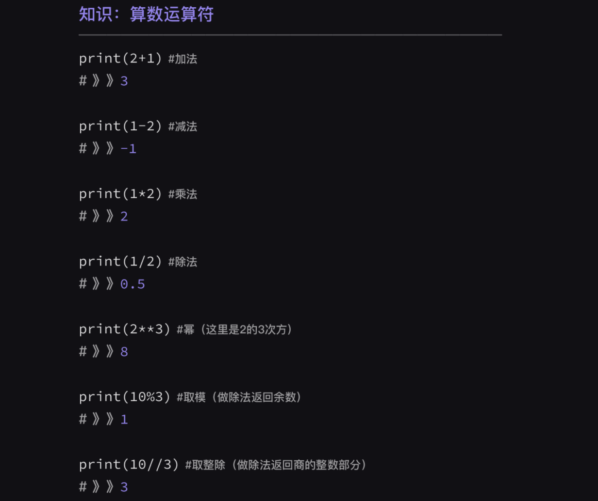
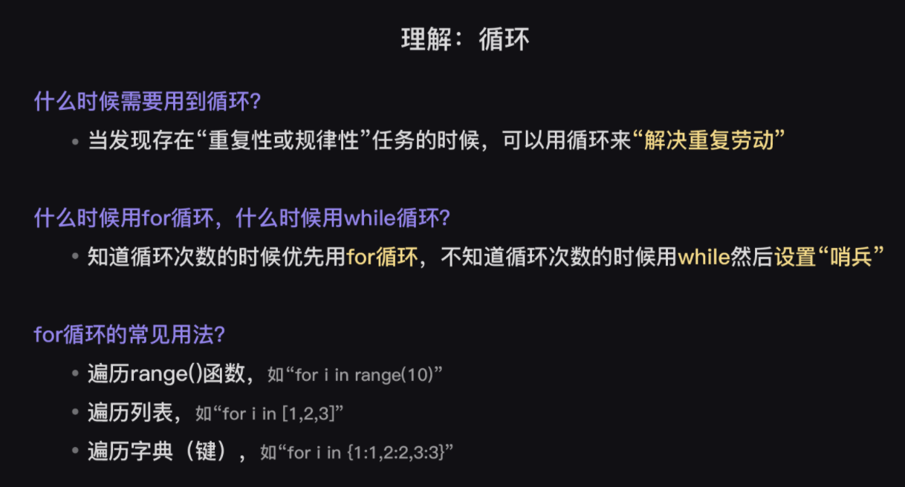
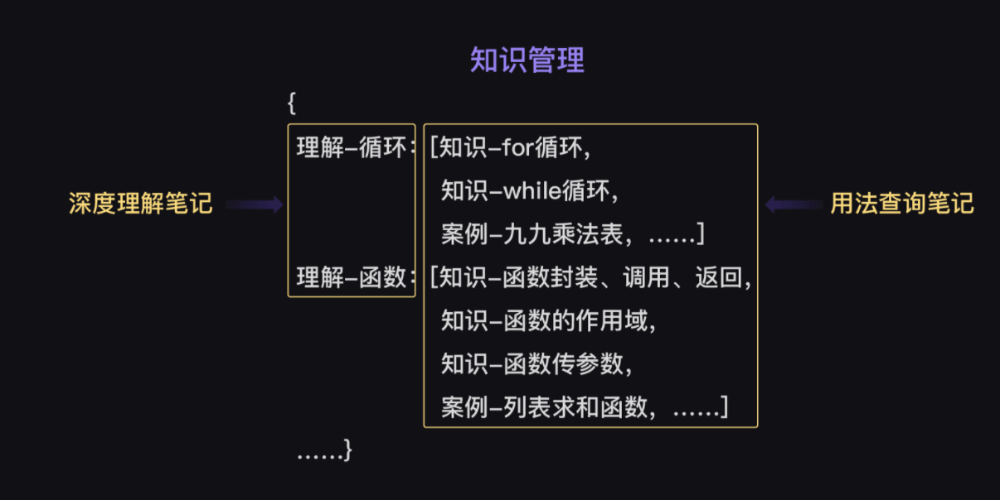

提供突破编程学习瓶颈的思路，习得高效学习Python的方法

## 编程学习的三项关键点
- 知识讲解: 掌握基本功
- 项目实操: 增加实战经验
- 思维锻炼: 增加内功，提升Python学习效率和应用水平。
> 我们学Python是为了利用编程来解决现实问题，为了达到这个目的，思维的培养是必不可少的。

## 编程学习的两大瓶颈
- 知识点学完就忘：明明学的时候记得，过一会就想不起来了
- 缺乏解题能力：知识明明学会了，但做题的时候却不会了

## 知识学完就忘
忘了就忘了吧，无所谓。实际项目中用的时候再去查文档也可以。

所有的编程知识并不是要靠死记硬背来【记住】，而是自己真正吸收，学会【怎么用】。

在编程学习中，【掌握】知识和【记住】知识是两个概念：【掌握知识】是知道有这个知识点，并了解它该往哪用，而【记住知识】只是强行记忆知识点，但不一定知道怎么用，用在哪。

记住知识 != 掌握知识

Python涉及到的知识点是非常多的，即便把脑子塞爆也不可能都【记住】。所以在初期，很多知识只需要你在使用的时候有个印象，遇到不明确的，就去翻看学习记录，找到知识点的具体用法，再运行代码检验。一回生两回熟，当你使用得足够多，你就会自然形成“肌肉记忆”，对使用场景和具体用法烂熟于心。

那么，如何快速提高【掌握】知识的程度——既加深对知识的印象，又知道知识的使用场景呢？

### 案例笔记法
包括两种类型的笔记
### 1、案例笔记-用法查询笔记
【用法查询笔记】解决的是“知识点是什么”的问题

主要记录知识点的基础用法，它是你的学习记录，能供你快速查阅，加深对知识的印象。

不管你用什么格式记笔记，目的只有一个，就是 “方便自己查询使用”。所以可以将笔记统一记录在可随时查阅的文件里。

**重视在案例中理解、消化知识。**
笔记的内容最好写出“代码含义”和“实际运行结果”的注释，这样才能加深对知识的第一印象，需要的时候才想得起笔记在哪。

当然，要记什么内容取决于你对具体知识点的熟悉度。
平时学习、工作中，遇到的零碎知识点，也可以及时补充到笔记里，方便日后查看。

一个最简单的 “算数运算符” 相关笔记参考：

上图，用小例子来说明不同算数运算符的用法，并且用注释说明了（1）代码含义（2）实际运行结果。代码含义往往用【#注释……】写在代码后面，实际运行效果往往用【# 》》注释……】写在代码下方。这样注释的话会更直观，比如当要区分'%'和'//'用法的时候就能一目了然。

### 2、案例笔记-深度理解笔记
【深度理解笔记】更侧重解决“为什么要用”以及“怎么用这个知识点”的问题。

有些知识光有印象还不够，还需要你知道这些知识该如何使用。所以我们需要【深度理解笔记】来总结、理解知识的使用场景。

【深度理解笔记】重在“理解”，所以笔记内容主要是记录对知识的理解。比如“什么时候需要用到这个知识？这个知识有什么常见用法？这个知识和其他知识有什么不同？”之类的问题，并写下自己的思考过程。

比如下边关于使用“循环”知识的理解笔记：

深度理解笔记不是一蹴而就的，它会随着你对某一知识的理解程度的加深而不断完善。

### 知识管理
【深度理解笔记】和【用法查询笔记】本质上就是一个“字典嵌套列表”，其中【深度理解笔记】是键，【用法查询笔记】是值。

基于这个结构，我们的知识框架就搭建起来了。因为我们有【深度理解笔记】，所以在解决一个编程问题的时候，我们可以轻易想到需要用到哪块知识，接着就可以去【用法查询笔记】里寻找相关的知识细节和具体案例，形成解题的思路。

在解决了问题之后，我们还可以把一些特别典型的案例，继续补充在【用法查询笔记】，是不是有点像以前上学时我们所做的错题集。

同样地，在解题的过程中，我们可能会专门搜索并自学一些额外知识，比如random模块（里面有许多随机函数）的使用方法，也可以一并记录在笔记里。
## 缺乏解题能力
缺乏解题能力，也就是看到题目，隐隐中知道要用什么知识，但就是会像便秘一样死活卡住。

这其中一个很重要的原因是还没有形成解题的思路，殊不知，解题技巧也是需要练习的。虽说解题思路是因人而异，但从中提炼共性的话，我会将解题步骤分为以下几步：

### 如何解题
* 1、分析问题，明确结果
* 2、思考需要的知识，或搜索新知识
* 3、思考切入点
* 4、尝试解决问题的一部分
* 5、重复1-4步

### 1、分析问题，明确结果
分析问题是解决问题的第一步，所以拿到题目的时候我们首先要思考“这是一个怎样的问题”。

为了让问题变得清晰，我们得先知道要实现的效果长什么样，即我们最终想要呈现在终端结果是什么样。

### 2、思考需要的知识，或搜索新知识
知道了需要实现的结果后，就需要思考解决这个问题到底要用到什么知识。
### 3、思考切入点
先从什么地方入手来解决这个问题。

从简单的切入点入手，解决一部分问题，往往会让问题变得更简单，更容易被解决。

### 4、尝试解决问题的一部分
解决问题的时候发现了新的问题，所以，我们回到第2步重新思考

很多零碎的知识点需要我们碰到实际问题的时候再去补充，这时就需要我们发挥“搜索大法”，主动搜索新知识。
### 5、重复1-4步
我们的解题步骤其实也是一个循环～所以当我们遇到复杂的题不要怂，学会拆解问题，找到突破口，就能一步步KO掉难题啦！
