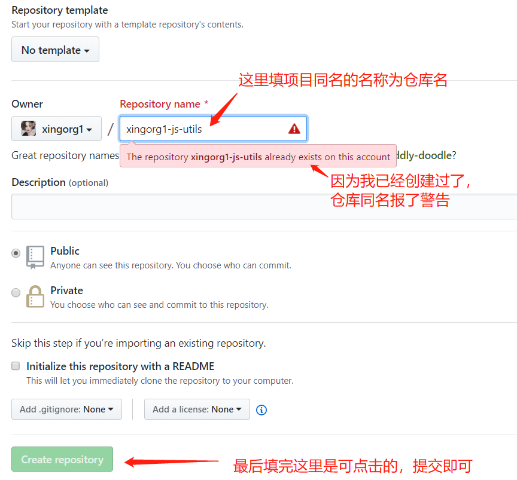

# 建好的项目上传到 github

## 准备本地仓库

本地建好的项目，事先没有建立 git 仓库。项目搞完了想传到 github，怎么弥补？

我的一次经历，遇见以下问题、一步一步用了以下步骤：

在当前项目根目录下检测 git 配置

```bash
$ git config user.name

$ git config user.email
```

检测如果不争取，就配置一下

```bash
$ git config user.name "你的 username"

$ git config user.email "你的 useremail"
```

确定无误，就执行 init 初始化一个 git 仓库

```bash
$ git init
```

出现如下信息。标识成功建立本地仓库:

> Reinitialized existing Git repository in E:/github/xingorg1-js-utils/.git/

## 尝试上传

上传到远端

```bash
$git add .

$git commit -m "提交说明"

$git pull

$git push

```

这里失败了！

## 失败流程

当我执行 git pull 时就报错了

```bash
$ git pull
```

失败提示信息:

> git fatal: No remote repository specified. Please, specify either a URL or a  
> remote name from which new revisions should be fetched.

不死心的执行 git push:

```bash
$ git push

```

失败提示信息:

> fatal: No configured push destination.
>
> Either specify the URL from the command-line or configure a remote repository using
>
>     git remote add <name> <url>
>
> and then push using the remote name
>
>     git push <name>

## 尝试添加远程仓库

于是我执行

```bash
$ git remote add origin https://github.com/xingorg1/xingorg1-js-utils.git
```

再进行 pull

```bash
$ git pull origin master
```

报错如下

> git push origin masteremote: Repository not found.  
> fatal: repository 'https://github.com/xingorg1/xingorg1-js-utils.git/' not found

```bash
$ git push origin master
```

报错如下

> remote: Repository not found.
> fatal: repository 'https://github.com/xingorg1/xingorg1-js-utils.git/' not found

## 远程仓库没有的情况下自查

于是我检查 ssh key

```bash
$ cd ~/.ssh
```

没有异常。

继续，cd 到项目目录。从新走流程

```bash
$ git init
```

返回：

> Reinitialized existing Git repository in E:/github/xingorg1-js-utils/.git/

正常。

检查 git 状态：

```bash
$ git status
```

返回：

> On branch master  
> nothing to commit, working tree clean

正常

执行无聊且无意义的暂存和提交：

```bash
$ git add .

```

```bash
$ git commit -m "[+]"

```

返回：

> On branch master
> nothing to commit, working tree clean

正常。

终于鼓足勇气执行 push：

```bash
$ git push

```

失败！

返回：

> fatal: The current branch master has no upstream branch.  
> To push the current branch and set the remote as upstream, use
>
>     git push --set-upstream origin master

按照神的指示，输入提示的命令。继续执行：

```bash
$ git push --set-upstream origin master
```

依旧不行~

提示：

> remote: Repository not found.  
> fatal: repository 'https://github.com/xingorg1/xingorg1-js-utils.git/' not found

直到现在，我才反应过来，说我**没有远端仓库!!!**

## 官网创建远程仓库

于是去[这个网址](https://github.com/new)上，创建跟项目名同名的仓库名


## finish

终于，再次执行 push 就正常了

```bash
$ git push --set-upstream origin master
```

返回：

> Counting objects: 37, done.  
> Delta compression using up to 4 threads.  
> Compressing objects: 100% (34/34), done.  
> Writing objects: 100% (37/37), 152.22 KiB | 4.61 MiB/s, done.  
> Total 37 (delta 1), reused 0 (delta 0)  
> remote: Resolving deltas: 100% (1/1), done.  
> To https://github.com/xingorg1/xingorg1-js-utils.git
>
> - [new branch] master -> master  
>   Branch 'master' set up to track remote branch 'master' from 'origin'.

真实一场与 bug 磕个头破血流的挣扎史啊！
