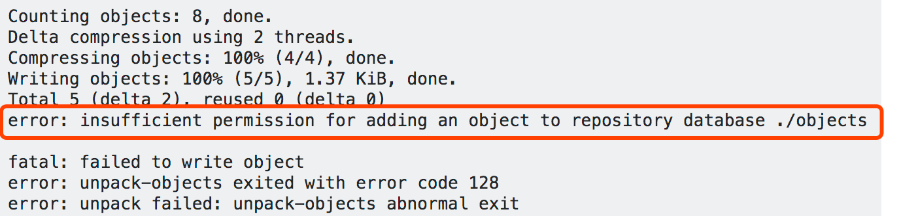

# 使用git命令遇到的异常及解决

## clone失败 curl 56 

报错具体命令如下：

`error: RPC failed; curl 56 OpenSSL SSL_read: SSL_ERROR_SYSCALL, errno 10054`

解决方案如下：


## clone失败 curl 18 b
遇到clone失败的第二种情况：

`error: RPC failed; curl 18 transfer closed with outstanding read data remaining`


## push错误 unable to access

报错具体命令如下：

`fatal: unable to access 'https://git仓库地址.git/': Empty reply from server`


## clone权限问题

错误命令如下
```bash
$ git clone git@git.jd.com:xxx/project.git
Cloning into 'project'...
git@git.jd.com: Permission denied (publickey).
fatal: Could not read from remote repository.
Please make sure you have the correct access rights
and the repository exists.
```

重点词”publickey“

那就需要设置公钥

解决方法如下：

百度github设置公钥“publickey”的方法

## git pull失败，没有写入权限

错误命令如下：
```bash
error: insufficient permission for adding an object to repository database ./objects
```



解决方案如下：

1、思否上有相同的问题。[传送门](https://stackoverflow.com/questions/1918524/error-pushing-to-github-insufficient-permission-for-adding-an-object-to-reposi)

2、思否上提供的解决方案
```bash
ssh me@myserver
cd repository/.git
sudo chmod -R g+ws *
sudo chgrp -R mygroup *
git config core.sharedRepository true
```
3、我的做法是，在项目更目录下运行：
```bash
cd .git
sudo chmod -R g+ws *
# 输入密码回车
# 再运行sudo chgrp -R mygroup *报错mygroup组名非法无效的
```

4、回到项目目录下，尝试直接git pull操作了下，一切又都正常了。

<Vssue title="【github】git遇到的异常错误与解决" />