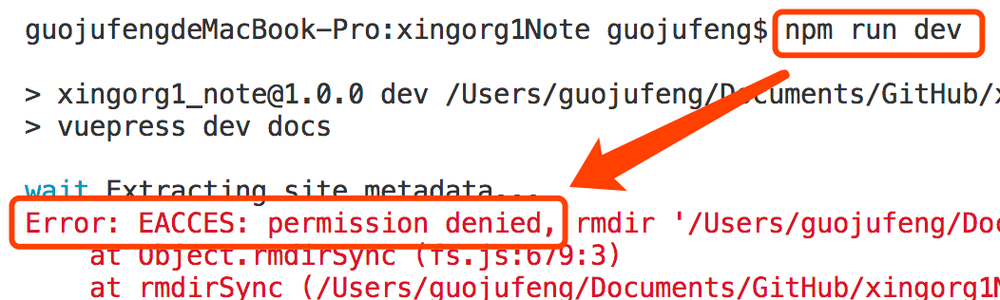
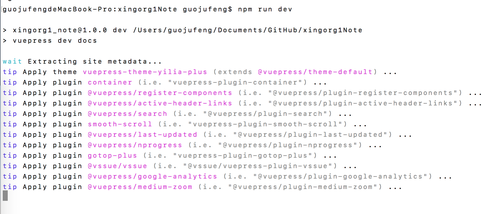

`mac`的命令行使用的时候，经常需要输入`sudo`，然后紧接着就需要输入password。有时候一个命令反复操作就很烦。能怎么调整一下不再用经常性的输入`sudo`呢？

下边截图就是，我没输入`sudo`直接运行的命令，然后就报错`Error: EACCES: permission denied`了。


说我没权限

项目根目录文件夹下使用命令观察文件的权限
```sh
ls -l
```

发现`node_modules`下的权限为`root`。所以每次必须用`sudo`来实现。

修改node_modules的root权限命令执行如下：
```sh
sudo chown -R guojufeng:admin node_modules
```
其中，chown修改文件目录属主，guojufeng是我的电脑名字。将node_modules改为admin。

因为我这里dist文件夹也是root权限，我索性返回项目目录(xingorg1Note)的上一级目录，一次性执行权限修改如下：
```sh
sudo chown -R guojufeng:admin xingorg1Note
```
之后，再次直接执行`npm run dev`，不借助sudo也成功了

