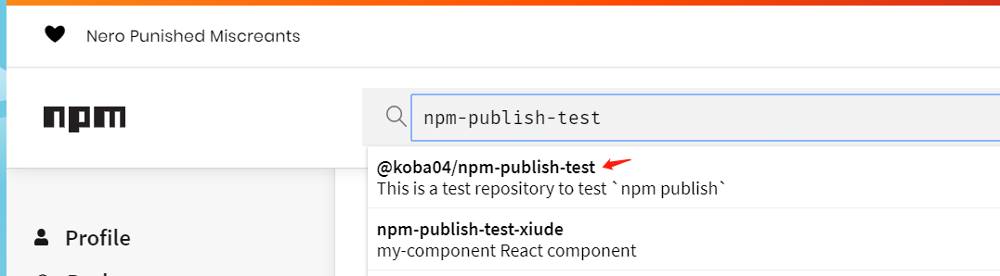
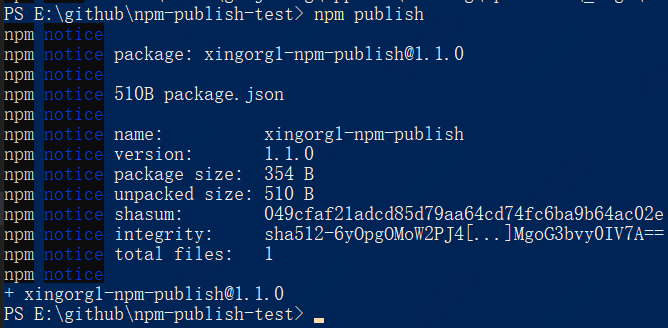
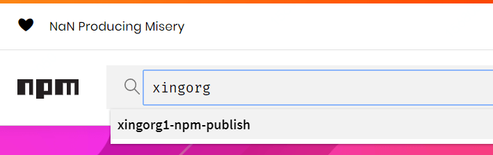

# NPM 包发布

## 账号注册与登录

先去[npm 官网](https://www.npmjs.com/)注册账号

第一次登陆：命令行执行命令"添加用户"

```bash
> npm adduser
（username）输入你的用户名
（password）输入你的密码
```

第二次以上登陆：命令行执行命令"登录用户"

```bash
> npm login
（username）输入你的用户名
（password）输入你的密码
```

## 创建包

在要创建文件夹的路径下，打开命令行。执行

```bash
npm init
```

按照指示填写所有信息。

- name 填写时，为了和 [npm 官网](https://www.npmjs.com/) 上已有的包冲突导致提交不成功，可以先去 npm 上搜下有没有同名的包已经被人抢先注册发布上去了。

比如我这个名字搜索时就发现已经被人注册了


## 发布包

在要发布的包处打开命令行，执行命令如下：

```bash
npm publish
```

## 发布报错

### 1、没权限发布

**具体报错如下：**

```bash
403 Forbidden - PUT https://registry.npmjs.org/npm-publish-test - You do not have permission to publish "npm-publish-test". Are you logged in as the correct user?
```

**翻译：**  
“您没有发布“np -publish-test”的权限。您是作为正确的用户登录的吗?”

**原因分析：**  
你要发布的包跟已有的包重名了。

**解决方案：**  
你要发布的包的 package.json 里边，name 的值赋值出来去[npm 官网](https://www.npmjs.com/) 搜索一下看是否确实有同名的包已经被人抢先注册发布上去了。

是的话，改个名字重新发布。（即把 name 的值改一下。确定 npm 上没有这个名字的包再去发布。）

### 2、包名触发垃圾回收机制

**具体报错如下：**

```bash
403 Forbidden - PUT https://registry.npmjs.org/npm-publish-test233333 - Package name triggered spam detection; if you believe this is in error, please contact support@npmjs.com
```

**翻译：**  
“包名触发垃圾邮件检测; 如果您认为这是错误的，请联系 support@npmjs.com”

**原因分析：**  
你要发布的包名字容易被当做垃圾包删掉。改个正常的名字。

**解决方案：**  
你要发布的包的 package.json 里边，name 的值赋值出来去[npm 官网](https://www.npmjs.com/) 搜索一下看是否确实有同名的包已经被人抢先注册发布上去了。

是的话，改个名字重新发布。（即把 name 的值改一下。确定 npm 上没有这个名字的包再去发布。）

### 3、邮箱认证

**具体报错如下：**

```bash
E403
you must verify your email before publishing a new package:
```

**翻译：**  
“发布一个 npm 包之前，你需要先认证你的邮箱”

**原因分析：**  
没有认证邮箱

**解决方案：**  
去[npm 官网](https://www.npmjs.com/)个人设置界面认证邮箱并激活即可

### 4、淘宝镜像源

**具体报错如下：**

```bash
E403
no_perms Private mode enable, only admin can publish this module:
```

**翻译：**  
“no_perms 私有模式启用，只有管理员可以发布此模块:”

**原因分析：**  
报错原因是因为 使用的是淘宝源 cnpm,登陆到的是 cnpm ([引自](https://www.jianshu.com/p/ce188df81540/))

**解决方案：**  
使用命令将仓库设置还原，切换到 npmjs 的网址。代码如下：

```bash
> npm config set registry http://registry.npmjs.org/
```

## 发布成功

胜利就长这个样子!



去[npm 官网](https://www.npmjs.com/) 搜索结果，发现确实发布成功


## 其他 npm 命令搜集

### 检查仓库淘宝镜像

检查仓库是否被设成了淘宝镜像库检查

```bash
> npm config get registry
```

### 回撤仓库淘宝镜像

若不想设置淘宝镜像，使用命令将仓库设置还原

```bash
> npm config set registry=http://registry.npmjs.org
```

### 设置淘宝镜像

```bash
> npm config set registry=https://registry.npm.taobao.org/
```
