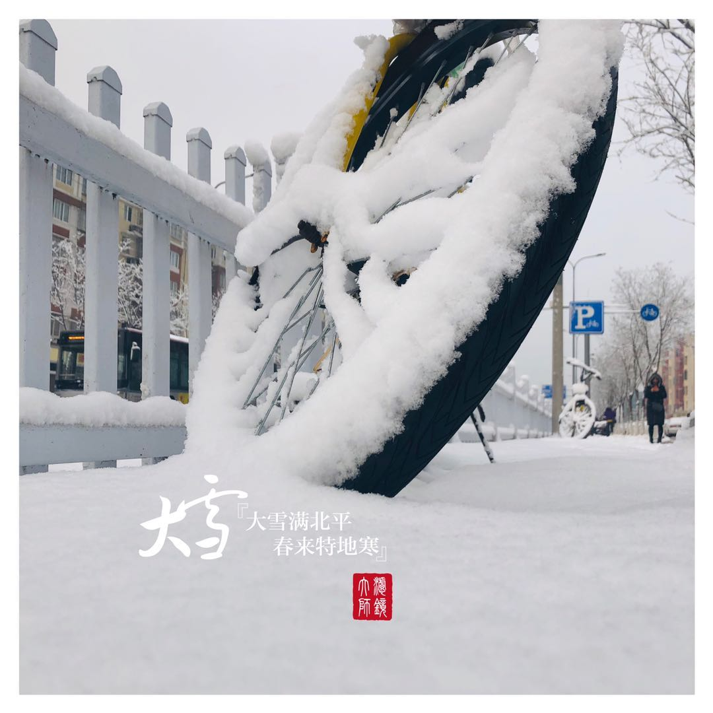
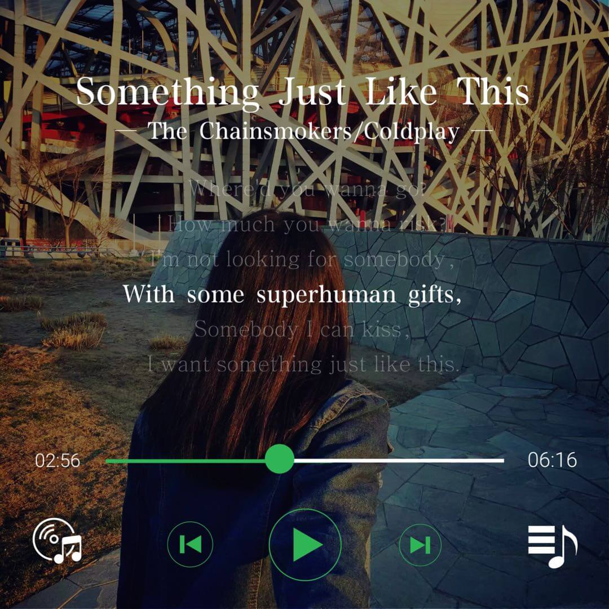
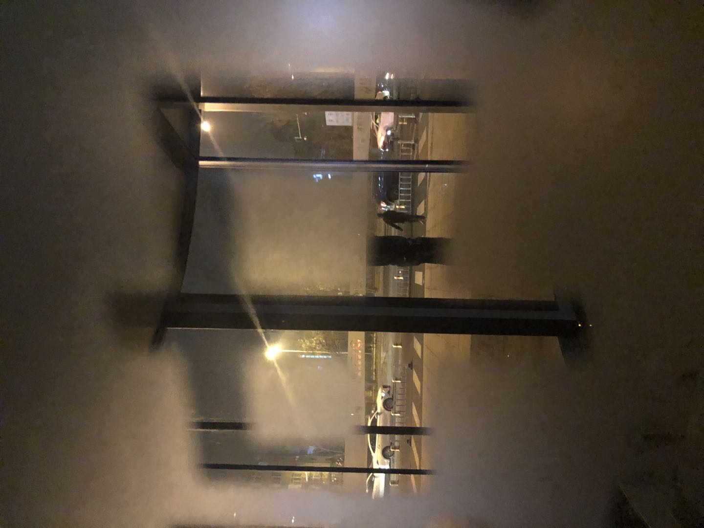

# 2020.01.18 - 只会前端让我很丢人

## 前言

今天突然有一种，做前端不丢人、但是只会前端可能会很丢人的感触。  
为啥这么感慨呢！  
听我慢慢给你道来~

## 背景
事情要从今天的年会说起。  
今天公司的技术部门一起出去年会团建。   
会上当然少不了活跃气氛的小游戏。   
其中我参加了一个猜词游戏，是我一个纯前端和一个专业的数据挖掘工程师一起上台参加。   
我的性格本来就比较腼腆、只要想到站到台上说话就会紧张。  
更别提在紧张的比赛气氛下让我上去真的面对这么多人做一个需要脑子转快点的游戏了。   
那需要多么强大的心理建设和自我催眠，才能拿出60%的心态去参加这个比赛类型的游戏呢！  
我这么想着的时候，背景音乐响起，主持人喊了我们第六组上台开始比赛。   

伴随着前景音乐缓缓淡出，我和那位同事被众人的目光送上舞台。  
我俩事前讲好了，他比划/描述、我猜词。  
甚至我们还拟定了一些小约定:   
比如“大佬”这个词，描述时就说“小的反义词、年轻的反义词，总的形容一个人厉害、技术特别盖！”。  
这样，即使此时有紧张心理，但也还算心理有点底气。

## 开始

当我自信的拿过话筒，站在舞台上背对着大屏幕的位置时，
我才发现，这也是我面对着台下大众的位置和方向。  

虽然我近视，但是我戴眼镜了！  

我横扫一遍，看到了无数期待的目光向我们投射而来。  
台下那一个个面庞朝向我们，一双双眼睛直直的看向我们。  
面朝观众的我当场感觉到有无数盏射光灯，刷刷刷的朝我打过来、集中到我的头顶。    
然后周围全暗淡了，只剩下我被眼光打的白亮。   

此时的我，脸上的那几个雀斑，应该都可以被看得无限清楚、无限清晰。  
作为人体里可成像的器官，那一双双的眼睛又让我感觉是一台台的史上最先进的高清彩色摄像机。  
我脸部肌肉哪怕有一点点的抽搐，都会被记录下来。  

台下的观众。他们每人还有一双双的耳朵，朝向我的左右手方向。  
不过我一会说的每一句话、每一个字，都会以光速传到他们的耳朵、并被他们照单接收。  

想到这里，我左手握紧右手、右手握紧话筒，拧了拧、转了转，仿佛又增加了一丝底气。  
正当我打算做一个深呼吸调整时，主持人喊了“计时开始！”，

世界都安静了，我的心脏停跳了。  

游戏开始了~

## 经过

### 绊倒
【“集市”】  
看到第一个词后，我的搭档眼前一亮、胜券在握的开始给我描述：“我们数据放在... 这里是一堆描述[数据集市]的词语”  
此时听到他前几个字，我的脑海里就一闪而过三个字：“(⊙o⊙)…我不会！”。  
于是当他描述完一遍，我思索三秒后大喊了一声“过！”。  
台下观众哄然大笑。 
此时的我还以为他们在笑我上来就”过“了一个词。  
### 绊倒
【”刷数“】  
紧接着是第二个词，我的搭档又是眼前一亮、胜券在握的开始描述：”当我们的历史数据【这里是一堆描述刷数的词语】“  
此时听到他前几个字”历史、数据...“，我的脑海里就一闪而过三个字：”我还是不会！(⊙o⊙)…“。  
于是我又大喊一声”过！“。  
台下又是一片哄然大笑。  
此时的我脸上有一次不好意思闪过。但我还能撑住、期待我们的下一个词。  
### 绊倒
【”透传“】  
这时到了第三个字，我的搭档描述到：”我们的数据从上游给到下游【这里是一堆描述透传的词语】“  
此时从”上游“、”下游“几个字里，我又判断出我不会了。感觉我被命运扼住了喉咙~  
这次我不敢喊”过“了，强撑着想让他再提示下。  
见我不说话，我的搭档又吧啦吧啦描述了些什么，我记不得了。  
我只记得台下的观众嘴角上扬，我的脸上微微发烫。  
我的搭档想要继续给我提供思路的时候，计分人员大喊，还有三十秒。  
  
我能明显感觉到，我的紧张和答不上来，有点微微拖累了同伴的心理，伴随着倒计时的逼近，他也开始紧迫起来。  
  
### 低谷
于是，接下来估计四个词都是专业性很强的词语，他一连喊了四个”过“之后，台下的观众又笑出了声。  
  
我想我刚笑完前边组只答对一个、我们肯定能答好几个，转脸我们不会只拿个零分下去吧，我也开始绷不住捂脸笑场了🤦‍♀️  
  
### 回光返照
终于，我的搭档为我找到了我能理解的一个词：  
搭档：”假的反义词“  
我：”真“  
搭档：”臭的反义词“  
我：”香“  
”真香！“，我瞬间反应。  
这个词，我们用了不到五秒。  
我心里暗暗庆祝不用拿零分了，甚至心里如释重负。  
  
## 结果
后来又经历了几轮猜词，最终我们一共对了三个，还有一个是“重构”。  
第三个我忘了我答对的是啥。但是都不重要了。   
除了当时答对那一秒的一丝快感和对胜利的期盼增添一分的心情外，其他都没有感受到。  

游戏结束。  

## 自责
下台后，只是深深的自责，感觉对不住我的搭档。  
他很想赢，但是我的无知与读书少拖了后腿。  
假如我懂那么一丢丢数据相关的知识点，我们今天就是全场的MVP。

”真香”是一个网络流行词。  
一直以高级工程师为目标的我，答不对专业性质的词语，只能答对这种广为流传的口水词。  
我不是嫌弃词语，我是嫌弃我自己——干啥啥不行，吃啥啥不剩。

## 自卑
当我比赛时，正对着我坐着的、台下的那些观众，  
他们都是世界五百强上市公司里的、大部分人级别基本上都在P7,8以上的、专门做数据挖掘、数据模型、数据应用以及大数据算法的高高级资深工程师！！！  
而且在这堆人里边，还有我的领导、我领导的领导、我领导的领导的领导。  
其中，我的领导站在台下，帮我们拍照。我的大领导就在台下正对着我的桌子旁边坐着。  
我刚才“闪现撞墙”的操作，他们都看到了眼里。

## 因为你是做前端的
### 所以你不“配”
我回到座位上，
战友旁边另一位认识我俩的同事说：“这些词语不该你俩搭。一个做数据的，一个做前端的，说不到一起去。”  
我为了掩饰自己的尴尬和丢脸，开始和他们讨论，问刚才我没说出来的那些词都是啥。  
当我听到“集市”、“刷数”、“透传”这些词时，我懊恼的“啊”了一声。

### 所以答不对
我们下台后的期间还有第七组人的比赛，我也没有心情看。  
只是沉浸在自己环节没有发挥好的失落心情里无法自拔。  
一阵闲聊慢慢平复心情之后，终于上了酒菜、换了环节。  

当大家开启瓶盖，主持人(是我们其中的同事)也下台来回到座位。  
我此时才发现我旁边的空位是留给他的。  
席间他和我碰杯喝酒的时候，他随口问了句：“你是做前端的吗？”  
我说：“是的”。  

是的，因为我是做前端的，所以刚才那些看似送分的题，我都没有答对。

### 所以你不会
平时办公时，大家工位离得远，只是个脸熟。  
彼此不交接的话，对方是什么岗位可能也不太熟悉。   
我现在想想，他怎么知道我是前端？  
大概是我下台交话筒时，他和我领导站在一起，听到了我和领导说了一句：“我要学后端”。  
也有很大的可能是我的领导帮我跟他解释了，我是前端岗位，所以那些词都答不上来。  

因为到了后来敬酒环节，我的领导也替我跟全场最大的领导解释：  
之所以面对“集市、透传”这些基础简单词语，在我的搭档描述的很清楚、几乎是把百度百科的词语讲解都说出来的情况下我依旧答不上来的原因 — — 我是做前端的。  

并说我答不上来，他们都能理解我。

## 近朱者，我没有赤
但我自己不理解自己。

因为我的工位紧邻我战友他们组的工位，他们都是数据岗的同事。  
浸泡在这个氛围里，什么“集市”、“刷数”这些词语，真的我每天都会从坐在我旁边的同事嘴里听到。  
即使我是做前端的，天天听、天天这么熏陶，都没熏出来我的一丝一毫非前端知识的长进。  

都说熟读唐诗三百首，不会作诗也会吟。  
常听的歌没学都会唱。  
但是又有什么用呢？  
自己不上进，再好的环境都染不红你。

即使是学一首歌曲，听了几百遍以后，你还要去再过几遍歌词的。  
何况是专业性的名词呢。  
只是听到这些词语，自己没有好奇心，不去了解、学习，当然还是不知道。  

要命的是，更因为他们都不是前端知识而不去关心、不去了解。

## 做前端，不能只知前端
做前端，不能只知前端。  
因为做前端就一点也不了解后端知识真的是不应该的！

### 初心曾不全是前端
我现在还记得，我丢人得红着脸走到舞台下并把话筒交给我那如兄长般和蔼的领导手里时，  
我懊恼和略带意气风发的对他说了一句“我要学后端！”。

是的，这句话，我17年就说过— —“我要做全栈、我要学后端”。  
今天，是2020年。期间两年，我曾经忘了自己的初心。

### 如今腿麻了心态崩了
说我给前端丢人是真，  
而且我也给我的骄傲丢人了。  

因为从前的我，很倔强。做了很多别人理解不了的事情，比如转前端。  
并且从前的我，也很要强。自己选择的路我是跪着也要走完，比如转前端。   
但是现在应该是腿跪麻了，对什么都无所谓了。 

有时候不想努力，会拿自己孤身一人在这宇宙中、没啥奋斗的意义为借口，来劝说自己继续赖床。  
什么都不想去学习了，心态崩了。

## 学习要以效果为目的
这件事还让我有了一个深刻的反省。    
起初选择做前端、学技术，  
我真的有很强烈的热情和很大的好奇心。    
遇到没听过的、不会的知识点，就立马去查、去了解。  

后来不知道怎么消磨的，越来越懒得动。  
对于新名词、新技术，不会主动去了解、学习，甚至会有抵触心理。  
即使因为工作被迫的去学一个知识点，也是一扫而过，潦草收场。  

**以结果为导向，不以效果为目的。**    
这个bug解决了就好、项目能跑就好。  
具体bug因为啥引起的？  
项目怎么能更优化？  
有没有新技术能让开发变得更高效、让产品界面变得更炫酷、让程序更流畅？  
我都不再关心和追求……

就好像，三餐一日，吃了就好。  
具体吃啥、能不能吃、吃了能不能消化，我都不在乎了。

## 不能做当代祥子
### 身上有祥子的影子
这几天在读老舍先生的书，  
我从《骆驼祥子》里边看到了我的影子。

倒不是我的时代不好，也不是我遇到的人不好。  
相反，我的时代和我的祖国环境是目前世界上、乃至历史上最好的，  
我身边遇到的人都是好人、都是我的贵人。  

但是我的自甘堕落和麻木，与祥子有的一拼。

### 祥子与我命运对照
那时候祥子想买辆自己的车。  
那时候我想从事我梦寐以求的前端岗。  

后来祥子遭遇战乱，车被抢了以后想靠自己的本事再攒够钱，重新买辆属于自己的车。但是从头再来太难了，祥子因为重重困难和坏蛋抢钱等种种原因没能如愿。    
后来我当了自己最喜欢的前端、相当于买上了自己最喜欢的车。可因为每天的“拉车”生活让我疲惫不堪，我渐渐迈不动脚步，不再是青壮年派的车夫。快要拉不动前端这辆车的同时，我也再不想前端这辆车歇工时，去拉后端那辆车。  

再后来祥子放弃了买车的心愿。  
再后来我也再提不起学习全栈的斗志。  

最后祥子就放弃了最开始的心愿，沦为了自己曾经最不屑的那种车夫。  
而我，我还没想好我的后来。

## 一专多长，一超多强。
通过这件事，我意识到在当今时代下、作为当代IT人，做技术要涉猎广泛的重要性。 

今天只是个小游戏。明天是让我和他们直接对接呢？我岂不是干瞪眼！！！🙄  
哪怕不是精通，哪怕只是皮毛，但是我们也得懂人家和你交流时，他说的是啥吧！！！

因为即使空调你不会创造，但至少遥控器怎么用，你得学学吧！  
不然万一哪天冻死在这冰天雪地的北京，也不会有人可怜你。  
甚至还会有人说你：“放着空调你不用，傻不傻！”

<Vssue title="[daily]:只会前端让我很丢人" />