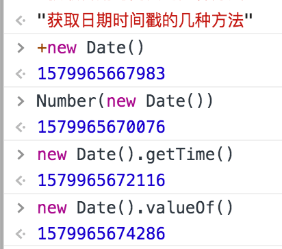
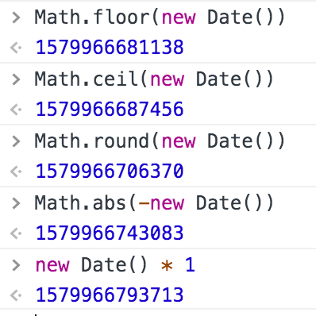

# knowledge Point
知识点啊！朋友们。知识点！画起来，要考的。

## resize只能绑定一个？
对的，用下边这种写法，一个页面中，resize只能绑定一个。

下边的代码，就永远只会打印出“2”，而没有“1”。
```js
// resize只能绑定、执行一个。此时只执行后边那个。
window.onresize = function(){
    console.log("1")
}
window.onresize = function(){
    console.log("2")
}
```
但是用下边这种写法，俩都可以执行了。
```js
// addEventListener绑定，就可以两次都执行
window.addEventListener("resize", function(){
    console.log("3")
});
window.addEventListener("resize", function(){
    console.log("4")
});
```

## JS获取时间戳的几种方法
利用内置的getTime()方法
```js
new Date().getTime()
```
利用+号运算符，实现类型转换，获取数字格式
```js
+new Date()
// 举一反三，也可以用其他方式获取数字格式：
-new Date() // ⚠️还需要再去掉-号,比如下边的写法
Math.abs(-new Date())
new Date() * 1
Math.floor(new Date())
Math.ceil(new Date())
Math.round(new Date())

```
使用原型链上的方法valueOf()
```js
new Date().valueOf()
```
原理了解了，依旧举一反三，简单粗暴使用Number方法转为数字
```js
Number(new Date())
```
上述方案实验截图：



