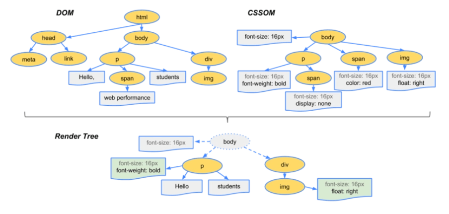
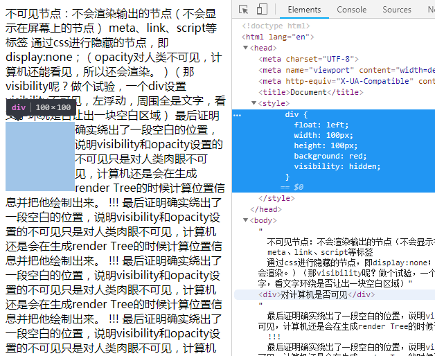
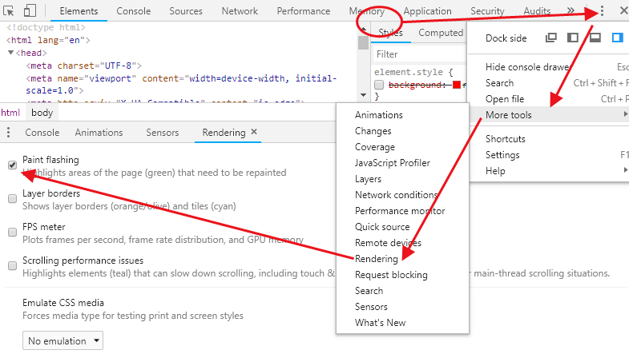

 <!-- [[toc]]  -->

# 为什么操作 DOM 会影响网页性能？

## 前言

面试官经常会问你：“平时工作中，你怎么优化自己应用的性能？”  
你回答如下：“我平时遵循以下几条原则来优化我的项目、以提高性能，主要有：”  
a. 减少 DOM 操作的次数（减少 DOM 的获取与修改次数）  
b. 减少网络请求  
c. 压缩、合并静态资源文件（css、js、img 等）  
d. 小图片文件 base64 化处理  
e. js 少用全局变量  
f. ...

Bingo！此时，你给自己抛了个可以把自己埋住的大坑。  
因为面试官可能会追问你：“为什么减少 DOM 操作可以提高性能？”

为什么呢？

---

## 1、dom 是什么？ES 和 DOM 是什么关系？

`DOM`就是`Document Object Model`，文档对象模型，里边是接口，即方法函数。我们通过调用并传指定参数来使用。  
官方定义：DOM 是一个独立于语言的、用于操作 XML 和 HTML 文档的程序接口(API)。在浏览器中主要用于与 HTML 文档打交道，并且使用 DOM API 用来访问文档中的数据。  
DOM 是个与 ES 语言无关的 API，它在浏览器中的接口却是用 JavaScript 来实现的，DOM 就成了现在 JS 编码中的重要部分。

### 1-1、各大浏览器中，DOM 的位置和 JavaScript 的位置（渲染引擎与 JS 引擎相互独立）

|    浏览器     | JS 位置                                                | DOM 位置                                                        |
| :-----------: | ------------------------------------------------------ | --------------------------------------------------------------- |
|      IE       | JavaScript 的实现名为 JScript，位于 jscript.dll 文件中 | DOM 的实现则存在另一个库中，名为 mshtml.dll（内部称为 trident） |
|    safari     | JavaScript 部分是由独立的 SquirelFish 引擎来实现。     | DOM 和渲染是使用 webkit 中的 webcore 实现                       |
| google chrome | JavaScript 引擎是他们自己研发的，名为 V8。             | 使用 webkit 中的 webCore 库来渲染页面                           |
|    firefox    | JavaScript 引擎名为 TraceMonkey                        | 渲染引擎 Gecko                                                  |

### 1-2、ES 和 DOM 是两种东西

ES 通多 DOM 接口来获取文档中的元素。  
正因为浏览器中通常把 DOM 和 ECMAScript 独立实现。使得**二者相互独立**，就像两座孤岛。  
所以 ES 每次操作 DOM 时，ES 和 DOM 之间就像两个桥之间需要过车辆。  
每次链接就都需要搭建一个桥梁，搭桥还是小事，ES 请求 DOM 的车辆过桥时，会经过一个收费站，每次都会被收费。JS 引擎会消耗浏览器的性能进行缴费。  
而车辆通过后桥就销毁，下次链接重新搭桥二次缴费。所以说**JS 与 DOM 每次连接都需要消耗性能** 。  
也正因此，有了**每操作一次 DOM 就多做点事**的理念，尽可能以最少的次数处理最多的 DOM 操作，以实现每过一次桥多拉点货的效果。  
（VUE 也正是这种理念，操作虚拟 dom 减少性能消耗，因此 vue 性能更优，另个话题来说。）

## 2、ES 每次访问 DOM 都需要消耗性能：

正因为二者相互独立，所以每次链接、每次访问 DOM 都会消耗性能！！ 可以说操作 dom 是十分昂贵的！！宁可处理一万次 js，也不操作一次 dom！！

## 3、ES 每次修改 DOM 元素的代价则更为昂贵

像上边说的，每次操作 DOM 之前，就会先**访问 DOM**，所以也会消耗性能。  
在此基础上，因为**修改 DOM**会导致浏览器重新计算页面的几何变化、引发浏览器模板引擎的**重排**(回流 - 回滚流程)和**重绘**，进而更加消耗性能。

## 4、浏览器渲染引擎的工作原理、工作流程是什么？

浏览器下载完页面中的所有资源（比如 HTML、JavaScript、CSS、图片等）后，会发生如下的 6 步过程：

1. 解析 HTML，构建 DOM 树（DOM Tree）
2. 解析 CSS，生成 CSS 规则树（CSSOM Tree）
3. 合并 DOM 树和 CSS 规则树，生成渲染树 render 树（render Tree）
4. 布局 render 树，根据生成的 render 树来对各元素尺寸、位置进行计算，得到每个节点的几何信息。（根据视口的大小来计算元素的位置和大小）（重排会走这一步）
5. 绘制 render 树，绘制页面像素信息（根据 render 树上每个节点的几何信息，得到每个节点的像素数）（重绘会走这一步）
6. 浏览器会将各层节点的像素信息发送给 GPU，GPU 将各层合成、绘制展示到页面上

### 4-1、浏览器渲染引擎是如何生成渲染树（render Tree）的？

先看一张图：  

由上图得知如下流程：

1. 从 DOM Tree 的根节点开始遍历每一个可见节点（除 meta、link、script 等这些标签；除 display:none;的元素）
2. 对于每个可见节点，在 CSSOM 中找到对应规则并将样式规则应用到对应节点上。
3. 根据每一个可见节点，以及其对应的样式，组合生成渲染树。

**不可见节点：** 不会渲染输出的节点（不会显示在屏幕上的节点）有以下几种

- meta、link、script 等标签;
- 通过 css 进行隐藏的节点，即 display:none；（opacity 对人类不可见，计算机还能看见，所以还会渲染。）（那 visibility 为隐藏的元素会不会被渲染呢？做个试验，一个 div 设置 visibility 不可见，左浮动，周围全是文字，看文字环绕是否让出一块空白区域。最后试验证明确实绕出了一段空白的位置，说明 visibility 和 opacity 设置的不可见只是对人类肉眼不可见，计算机还是会在生成 render Tree 的时候计算位置信息并把他绘制出来。试验结果如下图：）

## 5、什么是浏览器渲染引擎的重排和重绘？

### 5-1、**重排**

当 DOM 的变化影响了元素的几何属性（宽和高），浏览器需要重新计算元素的几何属性，同样其他相邻元素的几何属性和**位置**也会因此受到影响。浏览器会使渲染树中受到影响的部分失效，并重新构造渲染树。这个过程称为“重排”。

换句话说，改变了页面中某元素的位置、尺寸大小，进而也就改变了他的占地面积。那这个元素修改了占地面积后，其后紧邻的元素就得挪动位置。给她让地儿（或者向前赶赶）。紧邻的元素挪动了，那紧邻元素后边的元素也会连锁效应式的修改。这就好比一排人排队。前边的人突然变胖了、变瘦了、向前挪了、向后挤了、都会导致队伍中后边的人也跟随之改变位置，由此导致一连串的人都挪动位置。这时浏览器就要重新排版各个受到影响的元素的位置。反应在渲染引擎的工作流程中也就是浏览器需要重新计算元素位置信息并布局 render 树。这就是**重排**。

### 5-2、**重绘**

完成重排后，浏览器会重新绘制受影响的部分到屏幕中，该过程称为**重绘**。  
因为重排在重绘的上一步，所以**重排发生后自然会导致重绘**。这个很好理解。

## 6、什么时候会引发重排？

当页面布局和几何属性改变时就需要重排：  
（核心就是：只要某个属性能导致位置信息发生改变，就会触发重排 ）

1. 添加或删除可见的 DOM 元素。(一堆人排队，添加即中间插入了一个人/删除即中间一个人走了，势必会影响后边排队的人的位置信息也发生改变)
2. 元素位置改变（重排就是因为位置信息改变了）
3. 元素尺寸改变( 外边距、内边距、边框厚度、宽度、高度等)
4. 内容改变，例：文本数量/内容改变、或图片被另一个不同尺寸的图片替代、字体大小改变、（文字加粗？）导致 DOM 元素位置、面积改变。【计算会消耗 CPU 的能力】
5. 页面渲染器初始化（这算重走流程吧，肯定要重排）
6. 浏览器窗口尺寸改变（位置信息会被迫调整，发生重排。见下图的 gif 图，一个页面中 div 元素的位置不受视口调整而修改，也会引发重排）【消耗 GPU 的计算能力】

试验：resize 视口，一个页面中 div 元素的位置不受视口调整而修改，也会引发重排  

## 7、打断浏览器的优化步骤

现代浏览器是相当完善的了，因为多次操作 DOM 会触发重排重绘、消耗性能。所以除了我们人为的、有意识的去控制操作 DOM 次数以外，浏览器在设计上进行了优化，也会智能的“节流”操作 DOM，比如实现队列化修改、批量执行。

解释来说就是，浏览器会有一个“队列”，用以存放（攒着）需要操作 DOM 的 js 程序。每当执行一次 js 操作 dom 的代码，这个队列里就先暂存一个程序。等到一段时间后，浏览器再集中、批量的链接一次"ES 岛"和"DOM 岛"（就是让 JS 引擎去链接渲染引擎），进而触发一次 DOM 操作。你可以形象的理解为“过一段时间发一班车”。

但是我们人类感知不到啊，可能会因为误操作打断浏览器的“节流”步骤。迫使浏览器中断当前的“等待”，去赶紧、立马进行一次 dom 操作。让浏览器赶紧执行完他攒在“队列”里的 JS 操作 DOM 的程序后返回最新的 DOM 位置信息给我们。这就好像电梯门定时自动关闭，但是你却手动按了关门按钮强迫关门一样。

这种情况就发生在我们获取 DOM 信息的时候：

**打断浏览器优化，强迫触发重排的属性：**  
offsetTop、offsetLeft、offsetWidth、offsetHeight  
scrollTop、scrollLeft、scrollWidth、scrollHeight  
clientTop、clientLeft、clientWidth、clientHeight  
getComputedStyle()

因为要跟浏览器请求最新的 DOM 信息，所以浏览器就得赶紧让 JS 引擎去渲染引擎那里进行一次 DOM 操作。

## 8、什么时候会引发重绘？

1. **重排必然引发重绘**，这是肯定的。因为浏览器的工作流程就是排版后渲染。重排会回流（回滚流程）到排版阶段，排版后需要重新绘制页面。
2. 单独触发重绘的情况：  
   除元素尺寸、位置发生改变以外的情况，（比如字体颜色、背景色等发生改变）。（我怀疑文字加粗也会触发重排，但是我没有证据。理论上来说如果在一个固定尺寸的 div 内加粗文字，应该不会影响后边元素的重排，但可能该 div 内部的其他相邻文字或元素会发生重排。）

试验 gif 图：  

（想到一个验证只发生重绘的情况，那就是后边也加点元素，如果重排了，后边的元素在控制台的检测下也会闪绿光。）

## 9、为什么不提倡重排和重绘？

既然知道了这个 dom 操作会触发重排、重绘。那又是为什么要尽量避免重排和重绘呢？  
换句话说，重排和重绘的副作用是什么？缺点是什么？

这就要引入 CPU 和 GPU 了。

**重排会占用 CPU**，dom 元素位置计算会消耗 CPU 的算力，所以应该尽量减少 CPU 的占用，使电脑不卡顿。  
**重绘会占用 GPU**，渲染页面时会消耗 GPU 的算力。

**GPU 的分类：**

1. 家用 GPU  
   适合做贴图、特效、光影等效果。不适合画图形。
2. 专业 GPU  
   适合画图形。不适合做贴图、特效、光影等效果。

DOM 操作基本就是画图形的，但浏览器中用的就是**家用 GPU，其画图形耗费的性能是专业 GPU 的几十倍**。所以不提倡频繁用装有家用 GPU 的浏览器绘制页面。也就是不提倡频繁触发重绘。

## 10、总结： 为什么操作 DOM 非常昂贵？

1. ES 和 DOM 是两种东西，每次连接都需要消耗性能
2. 操作 DOM 会导致重排和重绘，重排会占用、消耗 CPU; 重绘会占用、消耗 GPU

## 11、控制台观察一个页面的重排和重绘现象

因为重排必然会引发重绘，所以在浏览器的开发者工具中提供了一个检测重绘的按钮。寻找和打开步骤如下图：  

#### 各 css 属性对重排重绘的影响：https://csstriggers.com/

<Vssue title="为什么操作DOM会影响网页性能？" />