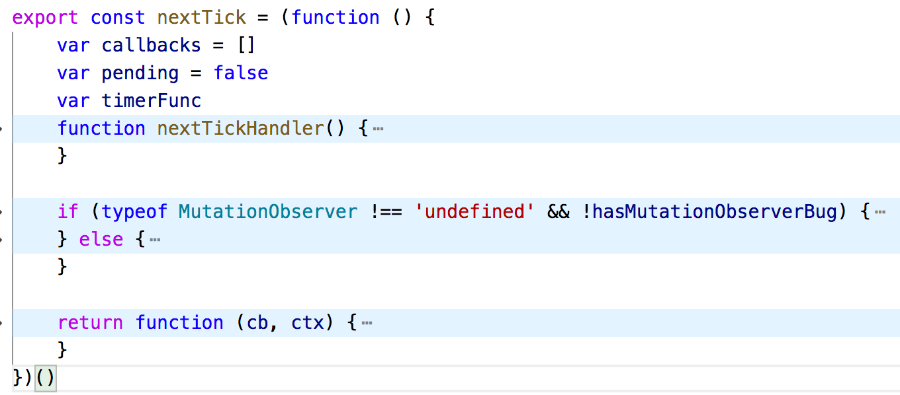
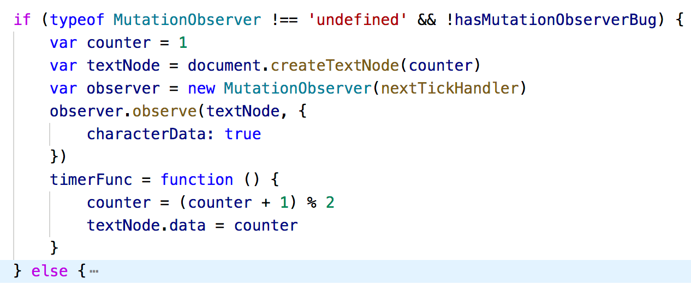
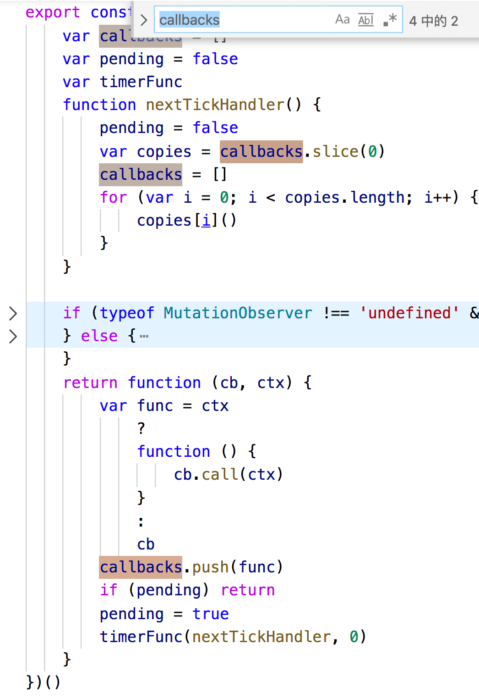

# nextTick源码解析
## 1、整体入手
阅读代码和画画是一样的，忌讳一开始就从细节下手（比如一行一行读），我们先将细节代码折叠起来，整体观察nextTick源码的几大块。

折叠后代码如下图



上图中，可以看到：

1. `nextTick`等于一个立即执行函数。函数执行后，内部返回另一个匿名函数`function (cb, ctx)`。从语义化命名可以分析，第一个参数`cb`是个回调函数、`ctx`这里先猜测应该是个上下文。

2. 在`return`返回之前，立即执行函数被调用后，函数内部先用var定义了三个参数、用function声明一个函数。

先不管这些变量是干啥用的。光从语义化命名上瞎分析一下：

* `callbacks`可能是一个装callback回调的数组，可能是将来有多个回调的时候模拟队列执行效果用的。

* `pending`是一个布尔值。pending这个单词在接口请求中会看到，可能是用来标识某个状态是否正在进行中的。

* `timeFunc`目前看来就不知道具体干啥的了。

* `nextTickHandler`函数先不管。用到的时候再来看。

以上，就是初始化对代码的分析。

## 2、逐行解析
看完大的代码块结构后，可以按照js引擎解析代码的顺序来分析源码了。前边的变量和函数声明看完后，就到解析if语句了。

在if条件中，有一个判断：`typeof MutationObserver !== 'undefined' && !hasMutationObserverBug`。

`MutationObserver`这玩意儿是干啥的？
### A、MutationObserver
度娘说他[“提供了监视对DOM树所做更改的能力”](https://developer.mozilla.org/zh-CN/docs/Web/API/MutationObserver)。大白话粗糙理解就是他能监听dom修改。

是HTML5中的一个新特性。

#### [`MutationObserver()`](https://developer.mozilla.org/zh-CN/docs/Web/API/MutationObserver/MutationObserver)
该属性提供一个构造函数`MutationObserver()`
> 通过`new MutationObserver()`可以得到一个新的观察器，它会在触发指定 DOM 事件时，调用指定的回调函数。
>
> **MutationObserver 对 DOM 的观察不会立即启动；而必须先调用 observe() 方法来确定，要监听哪一部分的 DOM 以及要响应哪些更改。**

#### [`observe(target[, options])`](https://developer.mozilla.org/zh-CN/docs/Web/API/MutationObserver/observe)
启用观察者，开始根据配置监听指定DOM。无返回值。

接收两个参数：
* `target`是Node/Element节点，表示要监听的DOM对象。
* `options`是监听配置，配置了target的哪些变动需要出发callback回调。配置项相关参数参照[MutationObserverInit配置字典](https://developer.mozilla.org/zh-CN/docs/Web/API/MutationObserverInit)

  * `attributes` : true|false， 观察受监视DOM元素的任意一个属性值变更
  * `attributeFilter`: 监听多个特定属性，放到数组里。如：`['class', 'id', 'src']`
  * `characterData` : true|false， 为true，则在更改指定要 监听的文本节点的内容时，将调用callback回调。
  * `childList` :true|false， 为 true 就监视指定DOM对象添加或删除新的子节点的情况
  * 还有其他好几个扩展情况。参考[MutationObserverInit配置字典](https://developer.mozilla.org/zh-CN/docs/Web/API/MutationObserverInit)


  > 当调用 observe() 方法时，childList，attributes 或者 characterData 三个属性之中，至少有一个必须为 true，否则会抛出 TypeError 异常。

#### 语法
```js
// 得到要观察的元素
var elementToObserve = document.querySelector("#targetElementId");

// 构造MutationObserver对象，传递一个函数当做参数
var observer = new MutationObserver(callback);

// 启用观察者observe(), 监听的DOM对象是elementToObserve
observer.observe(elementToObserve, { // 监听规则，当子节点或目标节点整个节点树中的所有节点被添加/删除的时候，触发上边的callback回调函数
  subtree: true,
  childList: true
});
```
当MutationObserver监听到我们注册的DOM被改变(无论是DOM节点改变、还是DOM的属性被改变，主要监听DOM的哪部分改变啥还是看你的配置项)时，回调函数callback就会被调用。
*（有点像我们派到云云DOM对象中的一个间谍，监视我们指定的dom，当发生改变时就告知我们）*


callback回调函数拥有两个参数：一个是描述所有被触发改动的 MutationRecord 对象数组，另一个是调用该函数的MutationObserver 对象。
不过这都是该属性的用法了，VUE关于nextTick的源码里关于这个属性没用到callback的这俩参数。这里不做展开讲解，详情可以看这里[ MDN MutationObserver()](https://developer.mozilla.org/zh-CN/docs/Web/API/MutationObserver/MutationObserver)

### B、if条件成立
好了，掌握了MutationObserver和他的用法后，再来回归源码，if里边的代码就很好理解了：


首先，作为H5新特性，其兼容性就是不太好（IE爸爸：看我干嘛！）


所以，vue这里做了容错，先判断MutationObserver的类型是否为“undefined”，来检查浏览器是否支持该特性。如果支持这个属性且无bug，那么就走if语句的内容

if语句内部三个var：
```js
var counter = 1
var textNode = document.createTextNode(counter)
var observer = new MutationObserver(nextTickHandler)
```
* 定义了一个`counter`数字
* `textNode`变量用于存放`document.createTextNode`创建的一个文本节点，文本内容是counter的值
* `new MutationObserver()` 这一行，相信有了上边知识点的铺垫，你就很容易理解了。构造并返回一个新的observer，用于在指定的DOM（就是上边的textNode）发生变化时，调用回调函数`nextTickHandler`。

接下来观察者observer，根据MutationObserverInit配置字段的设置，监听textNode元素。当textNode文本节点的文本内容发生一丢丢变化时，就会立即触发nextTickHandler回调函数。
```js
var observer = new MutationObserver(nextTickHandler)
observer.observe(textNode, {
  characterData: true
})
```

再接下来就是把代码顶部定义的timerFunc变量赋值为一个函数。
```js
timerFunc = function () {
  counter = (counter + 1) % 2
  textNode.data = counter
}
```
函数内部通过`(counter + 1) % 2`的表达式思想，让counter的值因为每次timeFunc函数的调用都会变成0/1。
并通过将counter变化后的值赋值给textNode节点，实现改变textNode文本节点的内容，达到触发observer监听、进而调取nextTickHandler回调函数的目的。

至此，if语句内部流程就走完了。我们趁热打铁，先不看else里的内容（脚指头掰也能想到里边应该是不兼容MutationObserver后的降级方案了。

根据if里边的思路，我们该看nextTickHandler里都是啥了，监听了DOM变化后，每次回调都干了撒？

### C、`nextTickHandler()`
逐句阅读代码：
```js
// 1
pending = false
```
每次nextTickHandler调用，`pending`先置为false，之前猜测pending是一个锁的想法，进一步得到了验证。
```js
// 2
var copies = callbacks.slice(0)
```
利用数组的slice()方法，传入起始下标0，不传终点下标，得到一个浅拷贝callbacks的新数组，并复制给`copies`。
```js
// 3
callbacks = []
```
重新赋值`callback`为一个空数组
```js
// 4
for (var i = 0; i < copies.length; i++) {
    copies[i]()
}
```
最后遍历`copies`数组，顺序调取copies队列里的函数。
郁闷了，这个copies里的（确切的说是callbacks里的）每一项函数都是个啥？哪来的？

这得看看callbacks这个变量在哪里赋值了、赋值的都是啥。于是我们
全局搜索callbacks，发现除了目前看到的三个，还有一个在`return` 的匿名函数里。


### D、`return`
本着哪里不会点哪里的原则，说明到了我们观察返回的这个匿名函数内部代码的时候了。

源码里，nextTick等于一个立即执行函数，函数执行完毕return一个匿名函数如下，也就是说，下边的代码就是我们调用nextTick的时候调用的函数。
```js
function (cb, ctx) {
  var func = ctx
      ?
      function () {
          cb.call(ctx)
      }
      :
      cb
  callbacks.push(func)
  if (pending) return
  pending = true
  timerFunc(nextTickHandler, 0)
}
```
#### `nextTick`用法
我们先回忆一下nextTick的用法：
```js
// modify data
vm.msg = 'Hello'
// DOM not updated yet
Vue.nextTick(function () {
  // DOM updated
})
```
可以看到，nextTick的第一个参数传入一个匿名函数。函数里边代码就是我们开发者执行nextTick后要运行的内容。

于是我们知道了，我们调用nextTick时传入的`function () { // DOM updated }`对应的就是return 后边匿名函数的`cb`参数。

#### 执行上下文
在匿名函数里边，先判断nextTick调用时第二个参数是否填，如果没填就直接将cb函数赋值给func变量。
```js
var func = ctx
  ?
  function () {
      cb.call(ctx)
  }
  :
  cb
```
如果填了第二个参数，func就等于一个匿名函数，函数内部利用`call`调用cb回调，改变cb内部this指向。由call调用时的传参为ctx可以推导出，nextTick的第二个参数ctx是一个上下文参数，用于改变第一个参数内部的this指向。

#### callbacks队列
紧接着将func函数推送到callbacks队列中：`callbacks.push(func)`。说明callbacks（也就是`nextTickHandler`函数里的copies）里存的就是nextTick的第一个回调函数参数。for循环执行的也就是他们。

#### pending加锁
```
if (pending) return
```
利用闭包，判断如果上一个nextTick未执行完毕，则本次的nextTick不能完整执行、会运行到了if这里被中断。

如果pending为false，说明上次的nextTick回调函数已经完了，可以进行本次执行。并紧接着`pending = true`将本次的nextTick调用状态改为pending中。

这pending就好像收费站的栅栏，上一辆车过去后立马落下杆子，上一辆车未缴费完毕、开走之前，不收起杆子。每次起杆子前，都看下是否有上一辆车正在堵着通道在缴费，如果没有，则可以开启杆子，让一辆车过去，放过一辆车后立马又落下杆子阻止后边的车。

#### timerFunc
最后调用`timerFunc(nextTickHandler, 0)`。

先来看看timerFunc是啥：

立即执行函数里声明后未被初始化

```js
var timerFunc
```

紧接着判断MutationObserver可用的话，在if代码块里被赋值为函数：
```js
timerFunc = function () {
  counter = (counter + 1) % 2
  textNode.data = counter
}
```
函数里修改counter的值并赋值给textNode.data:

这个我们上边分析过，当指定的DOM“textNode”文本节点的文本内容发生变化时，MutationObserver对象的ovserve监听方法就会立即调用回调函数`nextTickHandler`。

于是我们知道了整个流程：timerFunc调用，也就等于nextTickHandler调用，nextTickHandler调用后，内部遍历调用copies的每一项，即遍历调用多个nextTick的第一个函数参数（这是因为pending把下一个nextTick拦住了，不过每次调用nextTick时的第一个回调参数都被push到callbacks里了，当有几个被阻塞的nextTick回调还没被执行的情况下，callbacks数组里就可能不止一个回调函数，因此就需要用for循环依次调用）。

至此，我们的整个流程终于疏通完了。

等等，人家调用`timerFunc`时有传参啊。MutationObserver里给timerFunc赋值时，匿名函数没接收参数啊。

### 优雅降级
这时我们全局搜索`timerFunc`，发现我们漏了一个else代码块还没看：
```js
else {
  const context = inBrowser ?
      window :
      typeof global !== 'undefined' ? global : {}
  timerFunc = context.setImmediate || setTimeout
}
```
这里，用“inBrowser”判断是否为浏览器环境，然后给context赋值为window/global/{}，

给timerFunc赋值为`context.setImmediate`(ie或者node环境)或者`window.setTimeout`（其他环境），主要看当前运行的环境。

这里是vue的降级处理方式，如果浏览器不支持MutationObserver的话，就用setImmediate，如果不支持setImmediate的话，就用setTimeout来模拟异步方式。

当流程走到else代码块里的话，timerFunc调用就需要传递一个匿名函数（这里为nextTickHandler）和一个interval的值（这里为0）了

<Vssue title="vue-nextTick源码解析" />


